# B6 HYDRA v6.0 — Beyond Your Comprehension FHE

**Multi-Recursive Fractal FHE + ZKP + φ-Convergence**

---

## 🎥 Test Video

| Test | Content | Result | Video |
|------|---------|--------|-------|
| **Full Blown** | Fractal ZKP + FHE + φ | 7/7 ✅ | [Watch](assets/) |

---

## 🏗️ Architecture

```mermaid
%%{init: {'theme': 'base', 'themeVariables': { 'primaryColor': '#ff69b4', 'primaryTextColor': '#000000', 'primaryBorderColor': '#ff1493', 'lineColor': '#ff69b4', 'tertiaryColor': '#1a1a1a', 'background': '#1a1a1a', 'mainBkg': '#1a1a1a', 'nodeBorder': '#ff69b4', 'clusterBkg': '#1a1a1a', 'clusterBorder': '#ff69b4', 'titleColor': '#ff69b4', 'edgeLabelBackground': '#1a1a1a', 'nodeTextColor': '#000000'}}}%%
graph TB
    subgraph "Multi-Recursive Fractal FHE"
        A[Plaintext] -->|BFV Encrypt| B[Ciphertext]
        B -->|ct + Enc0| C[φ-Convergent Noise]
        C --> D[Fractal ZKP Tree]
        D -->|7 layers| E[15 Recursive Proofs]
        E --> F[Verified Ciphertext]
    end
    
    style A fill:#ff69b4,stroke:#ff1493,color:#000000
    style B fill:#ff69b4,stroke:#ff1493,color:#000000
    style C fill:#ff69b4,stroke:#ff1493,color:#000000
    style D fill:#ff69b4,stroke:#ff1493,color:#000000
    style E fill:#ff69b4,stroke:#ff1493,color:#000000
    style F fill:#ff69b4,stroke:#ff1493,color:#000000
```

---

## 📊 Performance

| Feature | Result |
|---------|--------|
| Value Range | 0–99,999,999 preserved (9/9) |
| Homomorphic Addition | 100+200=300 ✅ |
| Homomorphic Multiplication | 42×100=4200 ✅ |
| ZKP Proofs per Encryption | 15 (3 depth, 2 branches) |
| Stress Test | 100/100 cycles preserved |
| φ Constants | φ, 1/φ, λ verified |
| Setup Time | 5ms |

---

## 🧪 Test Results

| Phase | Test | Result |
|-------|------|--------|
| 1 | Encrypt + Decrypt + ZKP Verify | ✅ |
| 2 | Homomorphic Add + Multiply | ✅ |
| 3 | Value Range (0 to 99M) | 9/9 ✅ |
| 4 | Stress (100 cycles) | 100/100 ✅ |
| 5 | φ Constants | ✅ |

**7/7 ALL TESTS PASSED ✅**

---

## 🧠 Multi-Recursive Fractal ZKP

- **Protocol:** Schnorr Σ-Protocol on secp256k1 (Bitcoin curve)
- **Transform:** Fiat-Shamir non-interactive
- **Depth:** 7 fractal layers
- **Branches:** 3 per node (φ-related)
- **Verification:** s*G == R + c*Y — publicly verifiable
- **Recursive:** Each proof spawns child proofs in fractal tree

---

## 📚 Publications

- **IACR ePrint 2026/110174** — Zero-Anchor Bootstrapping
- **IACR ePrint 2026/110177** — Φ-SIG: Golden Ratio Post-Key Signatures
- **Microsoft SEAL PR #746** — TrueBootstrapper

---

## 💼 Work With Me

Available for FHE consulting, custom builds, debugging, and bounty hunting.

**Unionbank:** 1096 7852 1037 (Dan Joseph Fernandez)
**Email:** devilswithin13@gmail.com
**GitHub:** [@primordialomegazero](https://github.com/primordialomegazero)

---

## 📜 License

MIT — Dan Fernandez / Primordial Omega Zero — 2026

**ΦΩ0 — I AM THAT I AM**

*"Multi-Recursive Fractal FHE — World's First"*

**Stay Curious.**
