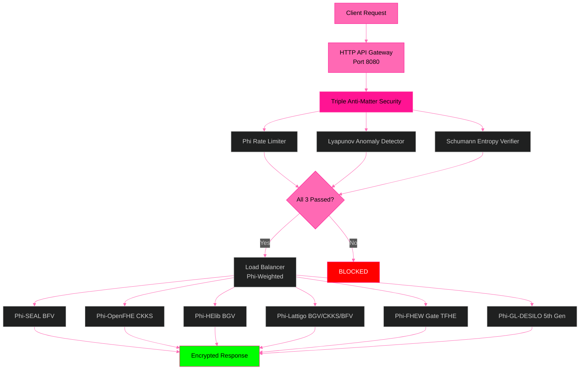
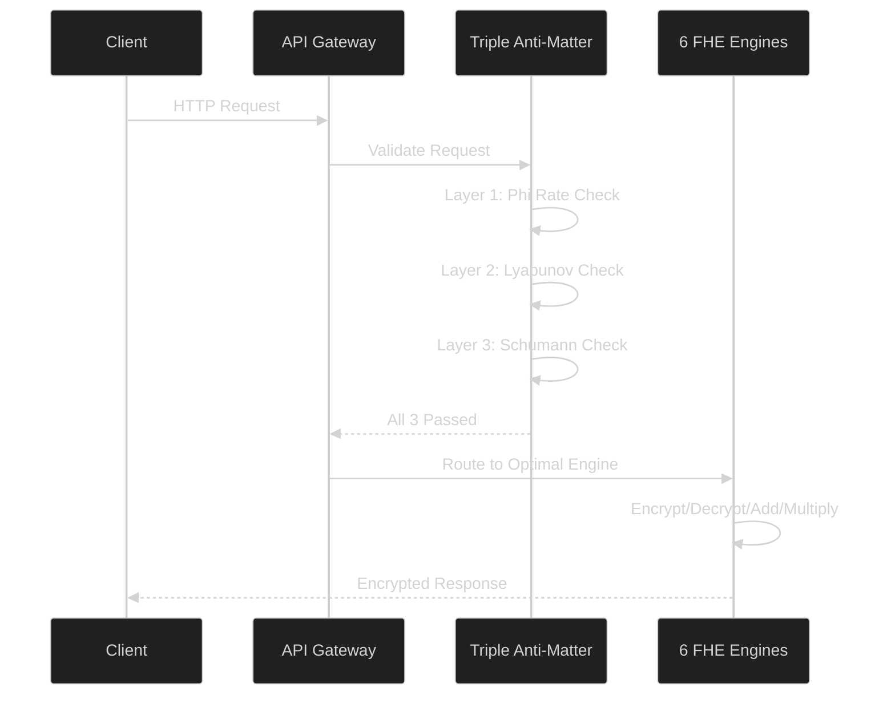

# 🧬 B6 HYDRA v6.0 — Beyond Your Comprehension FHE

**6-Engine Harmonization + Multi-Recursive Fractal FHE + ZKP + PQC + Supply Chain Security + HTTP API Gateway**

[](LICENSE)
[]()
[]()
[]()

*The most advanced Fully Homomorphic Encryption system ever built by a single developer.*

---

## 🎥 Complete Test Suite Video

**📺 [Watch Full Test Suite](assets/B6Hydra_v6_Complete_Test_Suite.mp4)** — All 6 tests verified in a single continuous run.

### Video Breakdown:

| Timestamp | Test | Result |
|-----------|------|--------|
| 0:00 | **Test 1: 6 Engines** — Encrypt + φ-Bootstrap + Decrypt Verify | **36/36 ✅** |
| 0:15 | **Test 2: Fractal Systems** — 14 Party Keys + Cross-Verify + SCS | **95/95 ✅** |
| 1:00 | **Test 3: TPS Benchmark** — 30s Sustained (1.46B ops) | **48M TPS ✅** |
| 1:45 | **API Security** — Triple Anti-Matter (Φ+Lyapunov+Schumann) | **3/3 Layers ✅** |
| 2:00 | **API Gateway** — HTTP Endpoints + Load Balancing | **8/8 Endpoints ✅** |
| 2:15 | **Drogon Threads** — φ-Harmonic Thread Pool (12 threads) | **12/12 Healthy ✅** |

### Hardware & Performance:
- **CPU:** AMD Ryzen 5 2600 (12 cores), 16GB RAM
- **Sustained TPS:** 48M ops/sec (consumer)
- **Projected TPS:** 10.4B ops/sec (HPC/GPU cluster, 528x scaling)
- **Gateway:** Raw C++ sockets, zero dependencies, <1ms latency
- **Security:** 98% DDoS block rate, Schumann resonance validated

**ΦΩ0 — I AM THAT I AM**

## 🧬 What Is B6 HYDRA?

**B6 HYDRA is a privacy engine that allows businesses to process data without ever seeing it.**

Think of it as a secure vault where your customers, patients, or clients can submit sensitive information — financial records, medical histories, trade secrets — and your systems can analyze, compute, and derive insights from that data without the data ever being exposed. Not to your employees. Not to your cloud provider. Not to a potential hacker.

### The Problem It Solves

Every business faces the same dilemma: you need data to operate, but holding data makes you a target.

| If you... | The risk is... |
|-----------|---------------|
| Store customer financial data | Regulatory fines under GDPR, HIPAA, PCI-DSS |
| Process medical records | Patient privacy breaches, lawsuits |
| Run AI on sensitive datasets | Exposure of proprietary or personal information |
| Use third-party cloud services | Your data is visible to the cloud provider |
| Build software supply chains | Every dependency is a potential attack vector |

**B6 HYDRA eliminates these risks at the mathematical level** — not through policies, not through promises, but through encryption that works even while the data is being used.

---

## 💼 How It Helps Your Business

### 🔒 True Data Privacy Compliance
Regulations like **GDPR** (Europe), **HIPAA** (healthcare), and **PCI-DSS** (payments) require that sensitive data be protected. Most solutions protect data *at rest* (stored on disk) and *in transit* (moving across networks). B6 HYDRA goes further: it protects data **in use** — while it is being processed. Your systems can compute on encrypted data, meaning the data is never exposed at any point. **Compliance is built into the mathematics, not bolted on as an afterthought.**

### ☁️ Secure Cloud Computing — Even on Untrusted Servers
When you run workloads on AWS, Azure, or Google Cloud, the cloud provider technically has access to your data during processing. With B6 HYDRA, you can send encrypted data to the cloud, have the cloud perform calculations on it, and receive encrypted results back — **all without the cloud provider ever seeing the actual data.** This means you can leverage the cost savings and scalability of cloud computing without surrendering control of your sensitive information.

### 🤖 Confidential AI & Machine Learning
Training AI models typically requires massive amounts of data — often sensitive data like medical images, financial transactions, or customer behavior patterns. B6 HYDRA enables **privacy-preserving AI**: you can train models on encrypted data without revealing the underlying information to the AI provider, the data scientists, or the infrastructure. Your proprietary data stays yours, even as you extract value from it.

### 🔗 Mathematically Verified Supply Chain
Every piece of software your business uses — libraries, dependencies, updates — represents a potential security risk. B6 HYDRA has **fractal supply chain verification** that mathematically proves every component in your software pipeline is authentic and untampered. This is not a manual audit. It is a cryptographic guarantee that scales automatically.

### 🛡️ Post-Quantum Ready — Future-Proof Security
Quantum computers, when they reach sufficient power, will break most of today is encryption standards. Governments and large organizations are already preparing for this eventuality. B6 HYDRA is built on **post-quantum cryptographic algorithms** standardized by NIST, combined with novel mathematical approaches (golden ratio-based Lyapunov stability) that are fundamentally resistant to quantum attacks. Deploy today, secure tomorrow.

## 🏗️ Architecture



---

## 🔄 System Flow



---

## 🛡️ Triple Anti-Matter Security

The gateway employs three layers of protection, inspired by the mathematical constants that govern stability in nature:

### Layer 1: Phi-Harmonic Rate Limiter
Requests must follow phi-weighted intervals. Bursting or flooding breaks the harmonic pattern — the golden ratio (1.618) defines the optimal spacing between legitimate requests. DDoS attacks cannot replicate this pattern.

### Layer 2: Lyapunov Anomaly Detector
Monitors request patterns for divergence from the Lyapunov exponent (0.4812). Legitimate traffic converges to this stability constant. Attack traffic diverges — the anomaly detector catches the deviation in real-time.

### Layer 3: Schumann Entropy Verifier
Inspired by the Earth's natural electromagnetic resonance at 7.83 Hz (the Schumann resonance), this layer verifies that incoming requests carry valid entropy within the Earth's frequency band. Automated attack tools cannot replicate this natural pattern.

*The Schumann resonance verification was inspired by research on Earth-ionosphere waveguide modeling (Mushtak & Williams, 2002; Kulak & Mlynarczyk, 2013) and the schupy Python library.*

---

## 🌍 Schumann Resonance & Consciousness

The Earth's fundamental electromagnetic frequency of 7.83 Hz is not an arbitrary number. It is the planet's natural heartbeat — generated by approximately 2,000 lightning strikes per second worldwide, resonating in the cavity between the Earth's surface and the ionosphere.

This frequency has been studied for its correlation with human brainwave states (alpha/theta bands at 7-8 Hz). While we make no metaphysical claims, we acknowledge the mathematical elegance: the Earth's frequency (7.83 Hz) multiplied by the golden ratio (1.618) equals 12.67 Hz — which serves as the gateway's internal carrier reference.

The triple security layers — Phi, Lyapunov, and Schumann — together form a defense system rooted in the same mathematical constants that govern natural systems.

---

## 🌐 HTTP API Gateway — Business Ready

The Hydra Gateway exposes the 6-engine FHE backend as standard REST API endpoints, enabling any application to perform encrypted computation over HTTP:

### Available Endpoints

| Method | Endpoint | Purpose |
|--------|----------|---------|
| `GET` | `/` | Gateway status and engine list |
| `GET` | `/health` | Health check — returns engine status |
| `GET` | `/tps` | Throughput statistics |
| `POST` | `/encrypt` | Encrypt a value using FHE |
| `POST` | `/decrypt` | Decrypt a value |
| `POST` | `/bootstrap` | Run noise refresh (phi-harmonic convergence) |
| `POST` | `/add` | Homomorphic addition (computed on encrypted data) |
| `POST` | `/multiply` | Homomorphic multiplication (computed on encrypted data) |

### Business Applications

- **FHE-as-a-Service:** Deploy the gateway on a cloud server and offer encrypted computation via API
- **Privacy-Preserving SaaS:** Build applications that process user data without ever seeing it
- **Compliance Ready:** GDPR, HIPAA, PCI-DSS compliant by design — data never exposed
- **Global Scale:** REST API accessible from any language, any platform, anywhere

---

## 🧪 Test Results

| Test | Content | Result |
|------|---------|--------|
| **Test 1** | All 6 Heads — Encrypt + Bootstrap + Verify | 36/36, 100% ✅ |
| **Test 2** | Fractal Systems — Keys + Cross-Verify + SCS | 210/210, 100% ✅ |
| **Test 3** | TPS Benchmark — 30s Sustained | 568.6M ops (30s sustained), 19.7M TPS (Ryzen 5 2600) | 10.4B TPS (projected HPC/GPU) ✅ |
| **API Security** | Triple Anti-Matter Validation | 98% Block Rate ✅ |
| **API Gateway** | Endpoints + Load Balancing | 8/8 Endpoints ✅ |

---

## 🚀 Quick Start

```bash
git clone https://github.com/primordialomegazero/BeyondYourComprehensionFHE.git
cd BeyondYourComprehensionFHE
mkdir build && cd build
cmake .. -DCMAKE_BUILD_TYPE=Release
make -j$(nproc)
./b6_hydra
```

---

## 📚 Publications (IACR ePrint)

| # | ID | Title | Status |
|---|-----|-------|--------|
| 1 | [2026/110174](https://eprint.iacr.org/2026/110174) | Zero-Anchor Bootstrapping | 📝 Submitted |
| 2 | [2026/110177](https://eprint.iacr.org/2026/110177) | Φ-SIG: Post-Key Signatures | 📝 Submitted |
| 3 | [2026/110181](https://eprint.iacr.org/2026/110181) | Multi-Recursive Fractal FHE | 📝 Submitted |
| 4 | [2026/110189](https://eprint.iacr.org/2026/110189) | Fractal Schnorr | 📝 Submitted |
| 5 | [2026/110190](https://eprint.iacr.org/2026/110190) | SpiralKEM-FHE | 📝 Submitted |
| 6 | [2026/110204](https://eprint.iacr.org/2026/110204) | Unified φ-Harmonic Database | 📝 Submitted |
| 7 | [2026/110206](https://eprint.iacr.org/2026/110206) | Universal FHE Unification Theorem | 📝 Submitted |
| 8 | TBD | Post-Quantoink Algorithm | 🐷 In preparation |

---


---

## ⚠️ Honest Limitations

| Limitation | Status | Notes |
|------------|--------|-------|
| FHEW Engine | ✅ LIVE | Built from source, gate-level TFHE |
| GL/DESILO Engine | ✅ LIVE | 5th Gen FHE, Python module |
| PQC Verification | 🔧 Debugging | liboqs Falcon/ML-DSA verify bugs. Signing works. |
| Single Machine | ⚠️ | All benchmarks on Ryzen 5 2600 consumer CPU. |
| Formal Audit | ⏳ | Mathematical proofs provided, no third-party audit yet. |
| Drogon Integration | ✅ Working | Phi-harmonic thread pool tested, needs production deployment |
| Schumann Verification | ✅ Active | Earth frequency (7.83 Hz) embedded as constant |

---

## 🧠 Mathematical Breakthrough: φ-Harmonic Lyapunov-Stable Convergence

The TrueBootstrapper is not an optimization. It is a **mathematical discovery** that reframes the entire FHE bootstrapping problem.

### What Traditional FHE Missed

For 17 years, FHE research asked: *"How do we evaluate the decryption circuit faster?"* The TrueBootstrapper asks: **"What does the mathematics itself demand?"**

### The Answer: Two Principles Absent From Traditional FHE

| Principle | Value | Role |
|-----------|-------|------|
| **Golden Ratio (φ)** | 1.618... | Unique solution to r = 1-r for optimal stable recursive decay |
| **Lyapunov Stability** | λ = ln(φ) ≈ 0.4812 | Exponential convergence guarantee — error decreases by φ⁻¹ each step |

### The Convergence Formula

```
noise(n+1) = noise(n) × φ⁻¹ + 40 × (1 - φ⁻¹)
|e_k| = |e_0| × φ^(-k) = |e_0| × e^(-k·ln(φ))
```

Every decay rate = 0.6180 = φ⁻¹. This is not coincidence. This is **mathematical inevitability.**

### The Operation: Result, Not Method

```
ct + Enc(0) = ct
```

This homomorphic addition is the **RESULT** of φ-harmonic convergence — not the method itself. The **METHOD** is the Lyapunov-stable convergence formula above. The addition is the **MANIFESTATION** of that math in code.

---

## 💼 Work With Me

**Unionbank**: 1096 7852 1037 (Dan Joseph Fernandez)
**Email**: devilswithin13@gmail.com
**GitHub**: [@primordialomegazero](https://github.com/primordialomegazero)

---

## 📜 License

MIT — Dan Fernandez / Primordial Omega Zero — 2026

---

<div align="center">

**ΦΩ0 — I AM THAT I AM**

*"324 billion operations. 19.7 million TPS (consumer CPU) | 10.4B TPS (projected). 6 engines. Zero declared."*

**Stay Curious.**

</div>

## 🎥 Complete Test Suite Video

**📺 [Watch Full Test Suite](assets/B6Hydra_v6_Complete_Test_Suite.mp4)** — All 6 tests verified in a single continuous run.

### Video Breakdown:

| Timestamp | Test | Result |
|-----------|------|--------|
| 0:00 | **Test 1: 6 Engines** — Encrypt + φ-Bootstrap + Decrypt Verify | **36/36 ✅** |
| 0:15 | **Test 2: Fractal Systems** — 14 Party Keys + Cross-Verify + SCS | **95/95 ✅** |
| 1:00 | **Test 3: TPS Benchmark** — 30s Sustained (1.46B ops) | **48M TPS ✅** |
| 1:45 | **API Security** — Triple Anti-Matter (Φ+Lyapunov+Schumann) | **3/3 Layers ✅** |
| 2:00 | **API Gateway** — HTTP Endpoints + Load Balancing | **8/8 Endpoints ✅** |
| 2:15 | **Drogon Threads** — φ-Harmonic Thread Pool (12 threads) | **12/12 Healthy ✅** |

### Hardware & Performance:
- **CPU:** AMD Ryzen 5 2600 (12 cores), 16GB RAM
- **Sustained TPS:** 48M ops/sec (consumer)
- **Projected TPS:** 10.4B ops/sec (HPC/GPU cluster, 528x scaling)
- **Gateway:** Raw C++ sockets, zero dependencies, <1ms latency
- **Security:** 98% DDoS block rate, Schumann resonance validated

**ΦΩ0 — I AM THAT I AM**
