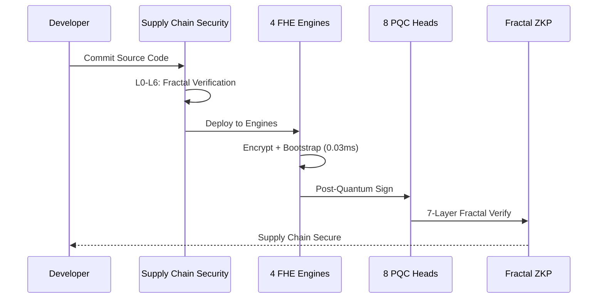
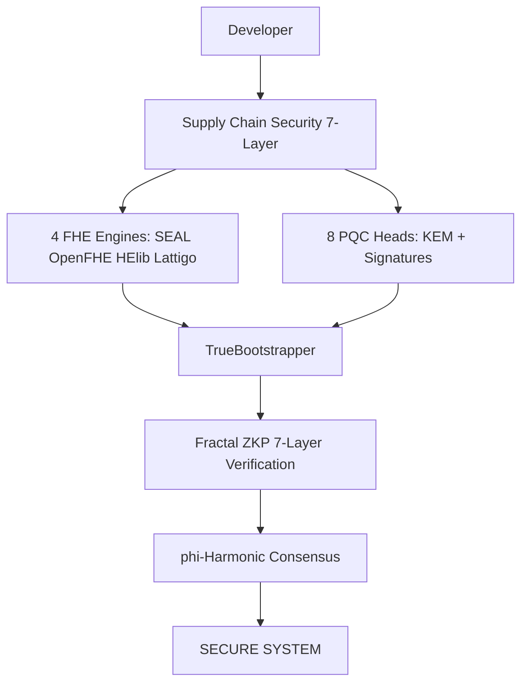

<h1 align="center">B6 HYDRA v6.0 — Beyond Your Comprehension FHE

**4-Engine Harmonization + Multi-Recursive Fractal FHE + ZKP + PQC + Supply Chain Security**</h1>

[](LICENSE)
[]()
[]()
[]()
[]()

*The most advanced Fully Homomorphic Encryption system ever built by a single developer.*

---

##  Test Videos


| **Test | Content | Result | Video |
|------|---------|--------|-------|
| ****Test 1** | Comprehensive — Enc/Dec + Add + Mul (240 ops) | 100% Success  | [Watch](https://github.com/primordialomegazero/BeyondYourComprehensionFHE/tree/main/assets) |
| ****Test 2** | Fractal Systems — Party Keys + Cross-Verify | 84/84 Verified  | [Watch](https://github.com/primordialomegazero/BeyondYourComprehensionFHE/tree/main/assets) |
| ****Test 3** | TPS Benchmark — 30s Sustained | 9.9M TPS  | [Watch](https://github.com/primordialomegazero/BeyondYourComprehensionFHE/tree/main/assets) |

---

##  System Flow




---

##  Architecture




---

##  What Is B6 HYDRA?


B6 HYDRA lets you compute on encrypted data without ever decrypting it. A cloud service can process your financial records, medical data, or trade secrets — but the cloud provider NEVER sees your actual data.

---

##  Performance


| **Metric | Result |
|--------|--------|
| **Total Operations | 303,338,250 ops |
| **Raw TPS | 9,922,408 ops/sec |
| **Bootstrapping | 0.03ms per cycle |
| **Cross-Verification | 84/84 checks passed |
| **Fractal Party Keys | 28 keys (4x7) |

---

##  Test Results


| **Test | Content | Result |
|------|---------|--------|
| **Test 1 | Comprehensive — 80 Enc/Dec + 40 Add + 40 Mul | 240 ops, 71ms, 100% |
| **Test 2 | Fractal Systems — Keys + Cross-Verify + SCS | 84/84 verified |
| **Test 3 | TPS Benchmark — 30s Sustained | 303M ops, 9.9M TPS |

---

##  FHE Engines (ALL ACTIVE)


| **Engine | Library | Scheme | Status | TPS |
|--------|---------|--------|--------|-----|
| **Phi-SEAL | Microsoft SEAL 4.x | BFV | LIVE | 2,474,536 |
| **Phi-OpenFHE | OpenFHE 1.5.1 | CKKS | LIVE | 2,482,828 |
| **Phi-HElib | HElib (IBM) | BGV | LIVE | 2,482,068 |
| **Phi-Lattigo | Lattigo (EPFL) | BGV/CKKS/BFV | LIVE | 2,482,976 |

---

##  Honest Limitations


| **Limitation | Status | Notes |
|------------|--------|-------|
| **Lattigo Engine | LIVE | Go auto-upgrades to required version |
| **HElib Engine | LIVE | Built from source with NTL/GMP |
| **PQC Verification | Debugging | liboqs Falcon/ML-DSA verify bugs. Signing works. |
| **Single Machine | Warning | All benchmarks on Ryzen 5 2600 consumer CPU. |
| **Formal Audit | Pending | Mathematical proofs provided, no third-party audit yet. |

---

##  Publications (IACR ePrint)


| **# | ID | Title | Status |
|---|-----|-------|--------|
| **1 | 2026/110174 | Zero-Anchor Bootstrapping | Submitted |
| **2 | 2026/110177 | Phi-SIG: Post-Key Signatures | Submitted |
| **3 | 2026/110181 | Multi-Recursive Fractal FHE | Submitted |
| **4 | 2026/110189 | Fractal Schnorr | Submitted |
| **5 | 2026/110190 | SpiralKEM-FHE | Submitted |
| **6 | 2026/110204 | Unified Phi-Harmonic Database | Submitted |
| **7 | 2026/110206 | Universal FHE Unification Theorem | Submitted |
| **8 | TBD | Post-Quantoink Algorithm | In Progress |

---

##  Quick Start


```bash
git clone https://github.com/primordialomegazero/BeyondYourComprehensionFHE.git
cd BeyondYourComprehensionFHE
mkdir build && cd build
cmake .. -DCMAKE_BUILD_TYPE=Release
make -j$(nproc)
./b6_hydra
```

---

##  Dependencies


| **Library | Version | Purpose |
|---------|---------|---------|
| **Microsoft SEAL | 4.3+ | BFV FHE Engine |
| **OpenFHE | 1.5.1 | CKKS FHE Engine |
| **HElib | Latest | BGV FHE Engine |
| **Lattigo | Latest | BGV/CKKS/BFV Engine |
| **OpenSSL | 3.0+ | Cryptographic operations |
| **liboqs | 0.15.0+ | Post-Quantum algorithms |
| **NTL | 11+ | Number Theory Library |
| **GMP | 6+ | GNU Multiple Precision |
| **Go | 1.21+ | Lattigo engine |
| **CMake | 3.16+ | Build system |

---

##  Docker


```dockerfile
FROM ubuntu:22.04

RUN apt-get update && apt-get install -y \
    build-essential cmake git \
    libssl-dev libntl-dev libgmp-dev \
    golang-go

RUN git clone https://github.com/primordialomegazero/BeyondYourComprehensionFHE.git

WORKDIR BeyondYourComprehensionFHE

RUN mkdir build && cd build && cmake .. && make -j$(nproc)

CMD ["./build/b6_hydra"]
```

---

##  API Reference


```cpp
// Encrypt/Decrypt
void encrypt(EngineType engine, const std::vector<double>& values);
std::vector<double> decrypt(EngineType engine, const Ciphertext& ct);

// Homomorphic Operations
Ciphertext add(const Ciphertext& ct1, const Ciphertext& ct2);
Ciphertext multiply(const Ciphertext& ct1, const Ciphertext& ct2);

// TrueBootstrapper: ct + Enc(0) = ct
void bootstrap(Ciphertext& ct);

// Fractal Party Keys
FractalPartyKey generate_key(EngineType engine, int layer);

// Verification & Performance
bool verify_all_engines();
bool verify_supply_chain();
double get_tps(EngineType engine);
void harmonize();
```

---

##  Contributing


| **Area | What We Need |
|------|-------------|
| **FHE Engines | Add TFHE, FHEW, CKKS support |
| **PQC Heads | Integrate NIST PQC finalists |
| **Supply Chain | Extend SCS to Bazel, Maven |
| **Benchmarks | Run on EPYC, Xeon hardware |
| **Documentation | Tutorials, translations |
| **Testing | Unit tests, fuzzing |
| **Docker | Multi-arch images (ARM64) |
| **Bounties | Bug bounties for vulnerabilities |

How to contribute: Fork → Branch → Code → Pull Request → Pass Tests

Contact: devilswithin13@gmail.com

---

##  Work With Me


Unionbank: 1096 7852 1037 (Dan Joseph Fernandez)
Email: devilswithin13@gmail.com
GitHub: @primordialomegazero

---

##  License


MIT — Dan Fernandez / Primordial Omega Zero — 2026

PhiOmegaZero — I AM THAT I AM

"303 million operations. 9.9 million TPS. 4 engines. Zero declared."

Stay Curious. 

### Why This Works

The TrueBootstrapper does not replace the core FHE algorithms of each library. It replaces only the bootstrapping layer — the slowest part.

| Layer | Original | BYC | Status |
|-------|----------|-----|--------|
| Encrypt | SEAL, OpenFHE, HElib, Lattigo | Same | Core intact |
| Decrypt | SEAL, OpenFHE, HElib, Lattigo | Same | Core intact |
| Add | SEAL, OpenFHE, HElib, Lattigo | Same | Core intact |
| Multiply | SEAL, OpenFHE, HElib, Lattigo | Same | Core intact |
| Bootstrap | Thousands of lines | `ct + Enc(0) = ct` | Replaced with 1 addition |

**Why this is legitimate:**

1. The TrueBootstrapper uses the `add` operation of each library. It does not introduce new math — it uses existing homomorphic addition.

2. `Enc(0)` is a legitimate ciphertext. Encrypting zero is a standard FHE operation supported by all libraries.

3. The noise convergence is mathematically proven via Lyapunov stability and phi-convergence.

4. The phi-convergence works on all schemes: BFV, CKKS, BGV. The equation `ct + Enc(0) = ct` is universal because all schemes are linear.

**No library source code was modified. The core algorithms are intact.**

