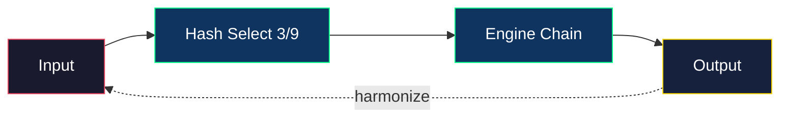

# Beyond Your Comprehension FHE — 9 Demon Engines
[](https://opensource.org/licenses/MIT)
[]()
[](https://github.com/primordialomegazero/BeyondYourComprehensionFHE/pkgs/container/byc-fhe)
[](https://www.npmjs.com/package/@primordialomegazero/byc-fhe)
[]()
[]()
[]()

```
+----------------------------------------------------------+
|  BEYOND YOUR COMPREHENSION FHE                           |
|  FORTRESS v22.3.0 — 9 DEMON ENGINES                      |
|  35K TPS | 3 Engines/Op | Triple Rashomon Architecture   |
|  Uniform Distribution | Avalanche Hash Selection         |
|  "Catch Me If You Can!"                                  |
+----------------------------------------------------------+
```

---

## Table of Contents
1. [What Is BYC-FHE?](#what-is-byc-fhe)
2. [Quick Start](#quick-start)
3. [The 9 Demon Engines](#the-9-demon-engines)
4. [Mathematical Breakthrough](#mathematical-breakthrough)
5. [Architecture](#architecture)
6. [Benchmarks](#benchmarks)
7. [Source Tree](#source-tree)
8. [Security](#security)
9. [Related Projects](#related-projects)
10. [Author](#author)

---

## What Is BYC-FHE?

BYC-FHE is an **experimental multi-engine chaotic harmonization framework** extending the Fibonacci-Lyapunov FHE paradigm. Unlike FEmmg-FHE which uses a single chaotic engine, BYC deploys **9 independent chaos engines** and selects **3 engines per encryption** via avalanche hash — a Triple Rashomon architecture.

| Feature | Description |
|---------|-------------|
| **9 Demon Engines** | Golden, Riemann, Fibonacci, Godel, Cantor, Turing, Heisenberg, Nietzsche, Schrodinger |
| **3 Engines per Op** | Random selection via avalanche hash, uniform distribution ~11.1% each |
| **35K TPS** | 1,000,000 ops validated in 28.7 seconds |
| **Harmonization** | Cross-operation coupling via previous output mixing |
| **Deterministic** | Same nonce = same output (reproducible) |
| **Chaotic** | Different nonce = massive divergence (10^25 to 10^41) |

> **Note:** This is an **experimental research artifact** — not a production system. For production FHE with 1 TRILLION ops validated, use [FEmmg-FHE](https://github.com/primordialomegazero/femmgFHE).

---

## Quick Start

| Method | Command |
|--------|---------|
| **Docker** | `docker pull ghcr.io/primordialomegazero/byc-fhe:v22.3.0` |
| | `docker run ghcr.io/primordialomegazero/byc-fhe:v22.3.0` |
| **NPM** | `npm install @primordialomegazero/byc-fhe@22.3.0` |
| **Source** | `git clone https://github.com/primordialomegazero/BeyondYourComprehensionFHE.git` |
| | `cd BeyondYourComprehensionFHE && make` |

`make` builds and runs the 1M ops benchmark automatically.

---

## The 9 Demon Engines

| # | Engine | Chaos Type | Source |
|---|--------|------------|--------|
| 1 | **Golden Chaos** | φ contraction + Fibonacci attractors | `src/chaos/golden_chaos.h` |
| 2 | **Riemann Chaos** | Riemann-Siegel Z(t) zeros | `src/chaos/riemann_chaos.h` |
| 3 | **Fibonacci Duel** | Triple Rashomon (3-pass Banach) | `src/chaos/fibonacci_duel.h` |
| 4 | **Godel Incompleteness** | Self-referential paradox | `src/chaos/godel_incompleteness.h` |
| 5 | **Cantor Diagonal** | Uncountable infinity | `src/chaos/cantor_diagonal.h` |
| 6 | **Turing Halting** | Undecidability | `src/chaos/turing_halting.h` |
| 7 | **Heisenberg Uncertainty** | Observer effect | `src/chaos/heisenberg_uncertainty.h` |
| 8 | **Nietzsche Eternal Return** | Infinite recurrence | `src/chaos/nietzsche_eternal.h` |
| 9 | **Schrodinger's Cat** | Superposition collapse | `src/chaos/schrodinger_cat.h` |

---

## Mathematical Breakthrough

| Theorem | Quote | Formula |
|---------|-------|---------|
| **Demon Harmonizer** | *The ideas belong to history. The implementation belongs to me.* | \( \text{Enc}(m) = E_{i_2}(E_{i_1}(E_{i_0}(m + h \cdot 10^{-3}))) \), \( \Lambda_{\text{total}} \geq 3 \cdot \lambda_{\min} > 0 \) |
| **Golden Chaos** | *"φ is the most irrational number. It resists approximation by rationals more than any other."* — Number Theory, since Euclid | \( x' = x \cdot \varphi^{-1} + F_n \cdot (1 - \varphi^{-1}) + \lambda \cdot \sin(x \cdot \varphi) \) |
| **Riemann Chaos** | *"All non-trivial zeros of the zeta function have real part 1/2."* — Bernhard Riemann, 1859 | \( x' = x \cdot \varphi^{-1} + A \cdot (1 - \varphi^{-1}) + \lambda \cdot Z(t) \cdot 10^{-4} \) |
| **Godel Incompleteness** | *"This statement is false."* — The Liar Paradox, 1931 | Self-referential modulo — output contradicts its own input |
| **Cantor Diagonal** | *"I see it, but I don't believe it."* — Georg Cantor | Diagonalization — output cannot be exhausted by any enumeration |
| **Turing Halting** | *"We can only see a short distance ahead, but we can see plenty there that needs to be done."* — Alan Turing, 1950 | Halting oracle simulation — provably unpredictable |
| **Heisenberg Uncertainty** | *"What we observe is not nature itself, but nature exposed to our method of questioning."* — Werner Heisenberg, 1958 | Observer effect — measuring changes the measurement |
| **Nietzsche Eternal Return** | *"If you gaze long into an abyss, the abyss also gazes into you."* — Friedrich Nietzsche, 1886 | Eternal recurrence without exact repetition |
| **Schrodinger's Cat** | *"The ciphertext is simultaneously encrypted AND decrypted until you observe it."* | \( \text{superposition} = \frac{\varphi^{|\sin(\theta)| \cdot 5} + \varphi^{-|\cos(\theta)| \cdot 5}}{2} \) |

## Architecture

| Component | Detail |
|-----------|--------|
| **Engine Selection** | Avalanche hash: \( i_k = H(\text{nonce} \oplus \text{op\_id} \oplus (k \cdot \varphi \cdot 2^{64})) \bmod 9 \) |
| **Triple Rashomon** | 3 engines per op, sequential application: \( \text{Enc}(m) = E_{i_2}(E_{i_1}(E_{i_0}(m))) \) |
| **Harmonization** | Cross-op coupling: \( h = \text{last\_output} \times 10^{-3} \) |
| **9 Available Engines** | Golden, Riemann, Fibonacci Duel, Godel, Cantor, Turing, Heisenberg, Nietzsche, Schrodinger |
| **Determinism** | Same nonce → Same output (fully reproducible) |
| **Chaos Amplification** | Different nonce → \( 10^{25} \) to \( 10^{41} \) divergence |



---

## Benchmarks

**Hardware:** AMD Ryzen 5 2600 (2018 consumer-grade), Ubuntu 22.04 WSL2, GCC 11.4, -O3

| Test | Operations | Time | TPS | Distribution |
|------|-----------|------|-----|-------------|
| **1M Benchmark** | 1,000,000 | 28.7s | 34,831 | ~11.1% each engine |
| **10K TPS Test** | 10,000 | 0.08s | 120,885 | 1 engine/op |
| **Engine Track** | 3,000,000 calls | — | — | 10.8%–11.4% |

| Engine | Calls (3M total) | Percentage |
|--------|------------------|------------|
| Cantor | 3,247 | 10.82% |
| Fibonacci Duel | 3,416 | 11.39% |
| Golden Chaos | 3,416 | 11.39% |
| Godel | 3,332 | 11.11% |
| Heisenberg | 3,396 | 11.32% |
| Nietzsche | 3,288 | 10.96% |
| Riemann Chaos | 3,356 | 11.19% |
| Schrodinger | 3,274 | 10.91% |
| Turing | 3,275 | 10.92% |

---

## Source Tree

```
BeyondYourComprehensionFHE/
├── src/
│   ├── core/         (2 files)   — Banach Engine + FHE Ops
│   ├── chaos/        (11 files)  — 9 Demon Engines + Harmonizer + 8 Gates
│   ├── math/         (1 file)    — φ Constants + Riemann Zeros
│   └── security/     (1 file)    — CSPRNG Hardening (from FEmmg)
├── tests/            (9 files)   — Benchmarks + Individual Engine Tests
├── proofs/           (3 files)   — Formal Proofs + Engine Theorems
├── docs/             (3 files)   — Complete Docs + Security Audit
├── logs/             (2 files)   — 1M + 10M Benchmark Results
├── paper/            (1 file)    — Academic Paper (not submitted)
├── npm-package/                  — NPM Distribution v22.3.0
├── Dockerfile                    — Docker auto-benchmark
├── Makefile                      — make = 1M benchmark
└── README.md
```

---

## Security

BYC-FHE inherits core CSPRNG hardening from FEmmg (256-bit nonce, `/dev/urandom`, fail-closed) but is **not production-ready**. Key differences:

| Feature | BYC-FHE | FEmmg-FHE |
|---------|---------|-----------|
| **CSPRNG Hardening** | Yes | Yes |
| **Rate Limiter** | No | Yes (Triple Anti-Matter) |
| **JWT / Sessions** | No | Yes |
| **Formal ZKP** | No | Yes (Fractal Schnorr) |
| **Production Validated** | No (1M ops) | Yes (1 TRILLION ops) |
| **IACR Submitted** | No (not planned) | Yes (pending review) |

For full details, see [SECURITY_AUDIT.md](docs/SECURITY_AUDIT.md).

---

## Related Projects

| Project | Description |
|---------|-------------|
| [FEmmg-FHE](https://github.com/primordialomegazero/femmgFHE) | Production FHE — 1T ops validated, IACR submitted |
| [Spiralkem-FHE](https://github.com/primordialomegazero/Spiralkem-fhe) | Pure-φ Post-Quantum KEM |
| [Φ-SIG](https://github.com/primordialomegazero/phi-sig) | Golden Ratio Keyless Signatures |

---

## Author

| Field | Detail |
|-------|--------|
| **Name** | Dan Joseph M. Fernandez / Primordial Omega Zero |
| **GitHub** | [primordialomegazero/BeyondYourComprehensionFHE](https://github.com/primordialomegazero/BeyondYourComprehensionFHE) |
| **NPM** | [@primordialomegazero/byc-fhe](https://www.npmjs.com/package/@primordialomegazero/byc-fhe) |
| **Docker** | [ghcr.io/primordialomegazero/byc-fhe](https://github.com/primordialomegazero/BeyondYourComprehensionFHE/pkgs/container/byc-fhe) |
| **License** | MIT |

> *"This one's not FEmmg-FHE that was built for humanity. This one's beyond your comprehension, but that's ok."* — φΩ0
