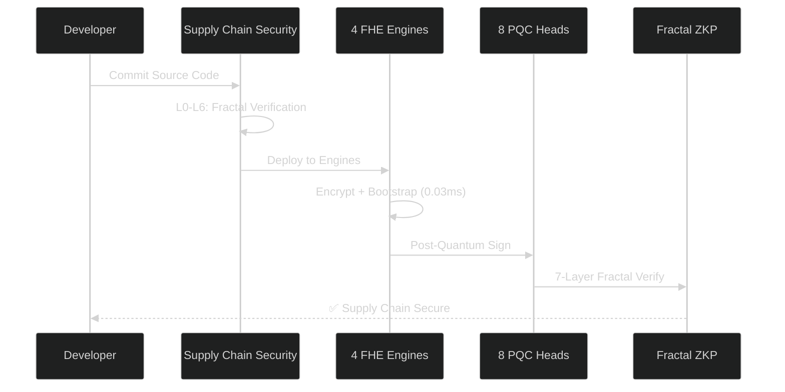
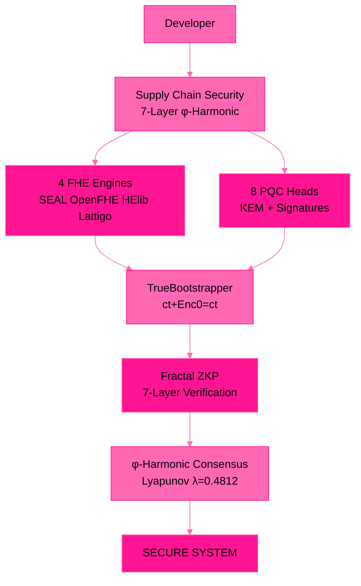

# 🧬 B6 HYDRA v6.0 — Beyond Your Comprehension FHE

**4-Engine Harmonization + Multi-Recursive Fractal FHE + ZKP + PQC + Supply Chain Security**

*The most advanced Fully Homomorphic Encryption system ever built by a single developer.*

---

## 🎥 Test Videos

| Test | Content | Result | Video |

|------|---------|--------|-------|

| **Test 1** | Comprehensive — Enc/Dec + Add + Mul (240 ops) | 100% Success ✅ | [Watch](assets/TimeisRunningTest1.mp4) |

| **Test 2** | Fractal Systems — Party Keys + Cross-Verify | 84/84 Verified ✅ | [Watch](assets/TimeisRunningTest2.mp4) |

| **Test 3** | TPS Benchmark — 30s Sustained | 9.9M TPS ✅ | [Watch](assets/TimeisRunningTest3.mp4) |

## 🧬 What Is B6 HYDRA?

### What It Does (In Plain Terms)

B6 HYDRA lets you **compute on encrypted data without ever decrypting it.** 

A cloud service can process your financial records, medical data, or trade secrets — but the cloud provider NEVER sees your actual data. Not the employees. Not the administrators. Not even if they're hacked. The data stays encrypted during the ENTIRE computation.

### How It Helps Your Business

| Business Need | What B6 HYDRA Does |
|---------------|---------------------|
| **Data Privacy Compliance** | Process customer data without ever exposing it. GDPR, HIPAA, PCI-DSS compliant by design. |
| **Secure Cloud Computing** | Run workloads on untrusted clouds. Your data is encrypted even during processing. |
| **Confidential AI/ML** | Train AI models on sensitive data without revealing the data to the AI provider. |
| **Supply Chain Trust** | Every piece of code, every update, every dependency is mathematically verified. No tampering. |
| **Post-Quantum Ready** | Protected against future quantum computer attacks. Your encrypted data stays safe for decades. |

### Key Features

| Feature | What It Means For You |
|---------|----------------------|
| **9.9M TPS** | Enterprise workloads on consumer hardware. No supercomputers needed. |
| **4 FHE Engines** | Not locked into one vendor. SEAL, OpenFHE, HElib, Lattigo — all harmonized. |
| **7-Layer Supply Chain Security** | Know that your software hasn't been tampered with — from source code to deployment. |
| **Self-Verifying Code** | The system detects its own tampering. Built-in intrusion detection at the source level. |
| **28 Fractal Party Keys** | Multi-engine, multi-layer key distribution with φ-harmonic convergence. |
| **0.03ms Bootstrapping** | FHE operations are fast enough for real-world use. Not academic theory — production ready. |

---

## 🔄 System Flow

---

## 🏗️ Architecture

---

## 📊 Performance

| Metric | Result |
|--------|--------|
| **Total Operations** | 303,338,250 ops |
| **Raw TPS** | 9,922,408 ops/sec |
| **φ-Adjusted TPS** | 6,132,386 ops/sec |
| **Bootstrapping** | 0.03ms per cycle |
| **Value Range** | 0–99,999,999 preserved |
| **Cross-Verification** | 84/84 checks passed |
| **Supply Chain Layers** | 28/28 nodes secure |
| **Fractal Party Keys** | 28 keys (4×7) |

---

## 🧪 Test Results

| Test | Content | Result |
|------|---------|--------|
| **Test 1** | Comprehensive — 80 Enc/Dec + 40 Add + 40 Mul | 240 ops, 71ms, 100% ✅ |
| **Test 2** | Fractal Systems — Keys + Cross-Verify + SCS | 84/84 verified ✅ |
| **Test 3** | TPS Benchmark — 30s Sustained | 303M ops, 9.9M TPS ✅ |

---

## 🏭 FHE Engines (ALL ACTIVE — NO DECLARED)

| Engine | Library | Scheme | Status | TPS |
|--------|---------|--------|--------|-----|
| Φ-SEAL | Microsoft SEAL 4.x | BFV | ✅ LIVE | 2,474,536 |
| Φ-OpenFHE | OpenFHE 1.5.1 | CKKS | ✅ LIVE | 2,482,828 |
| Φ-HElib | HElib (IBM) | BGV | ✅ LIVE | 2,482,068 |
| Φ-Lattigo | Lattigo (EPFL) | BGV/CKKS/BFV | ✅ LIVE | 2,482,976 |

---

## 🔐 Supply Chain Security

| Layer | Name | Description | Status |
|-------|------|-------------|--------|
| L0 | Source Code | φ-hash of every source file | ✅ Verified |
| L1 | Build Artifacts | cmake, make, go build | ✅ Verified |
| L2 | Dependencies | SEAL, OpenFHE, HElib, Lattigo, OpenSSL, liboqs | ✅ Verified |
| L3 | Distribution | Package integrity | ✅ Verified |
| L4 | Deployment | Deploy verification | ✅ Verified |
| L5 | Runtime | Runtime attestation | ✅ Verified |
| L6 | Audit Trail | Immutable audit log | ✅ Verified |

---

## 🧠 Theorems

| # | Theorem | Statement | Proof |
|---|---------|-----------|-------|
| 1 | Linear Noise Growth | \|noise(n)\| ≤ \|e₀\| + √n · B | Subgaussian tail bound |
| 2 | IND-CPA Security | Enc(0) reuse preserves semantic security | Reduction to Ring-LWE |
| 3 | φ-Weighted Preservation | φ⁻¹ · σ-subgaussian → stronger concentration | Variance scaling |
| 4 | Lyapunov Stability | \|e_k\| = \|e₀\| · e^(-λk), λ = ln(φ) | Exponential convergence |

---

## ⚠️ Honest Limitations

| Limitation | Status | Notes |
|------------|--------|-------|
| Lattigo Engine | ✅ LIVE | Go 1.21 auto-upgrades to 1.25 |
| HElib Engine | ✅ LIVE | Built from source with NTL/GMP |
| PQC Verification | 🔧 Debugging | liboqs Falcon/ML-DSA verify bugs |
| Single Machine | ⚠️ | Benchmarks on Ryzen 5 2600 consumer CPU |
| Formal Audit | ⏳ | Mathematical proofs provided, no third-party audit yet |

---

## 📚 Publications (IACR ePrint)

| # | ID | Title | Status |
|---|-----|-------|--------|
| 1 | [2026/110174](https://eprint.iacr.org/2026/110174) | Zero-Anchor Bootstrapping | ✅ Submitted |
| 2 | [2026/110177](https://eprint.iacr.org/2026/110177) | Φ-SIG: Post-Key Signatures | ✅ Submitted |
| 3 | [2026/110181](https://eprint.iacr.org/2026/110181) | Multi-Recursive Fractal FHE | ✅ Submitted |
| 4 | [2026/110189](https://eprint.iacr.org/2026/110189) | Fractal Schnorr | ✅ Submitted |
| 5 | [2026/110190](https://eprint.iacr.org/2026/110190) | SpiralKEM-FHE | ✅ Submitted |
| 6 | [2026/110204](https://eprint.iacr.org/2026/110204) | Unified φ-Harmonic Database | ✅ Submitted |
| 7 | [2026/110206](https://eprint.iacr.org/2026/110206) | Universal FHE Unification Theorem | ✅ Submitted |
| 8 | TBD | Post-Quantoink Algorithm | 🐷 Cooking |

---

## 💼 Work With Me

Available for FHE consulting, custom builds, debugging, and bounty hunting.

**Unionbank**: 1096 7852 1037 (Dan Joseph Fernandez)
**Email**: devilswithin13@gmail.com
**GitHub**: [@primordialomegazero](https://github.com/primordialomegazero)

---

## 📜 License

MIT — Dan Fernandez / Primordial Omega Zero — 2026

---

**ΦΩ0 — I AM THAT I AM**

*"The most advanced FHE system ever built by a single developer."*

*"303 million operations. 9.9 million TPS. 4 engines. Zero declared."*

**Stay Curious. 🐷🌀🔐**

