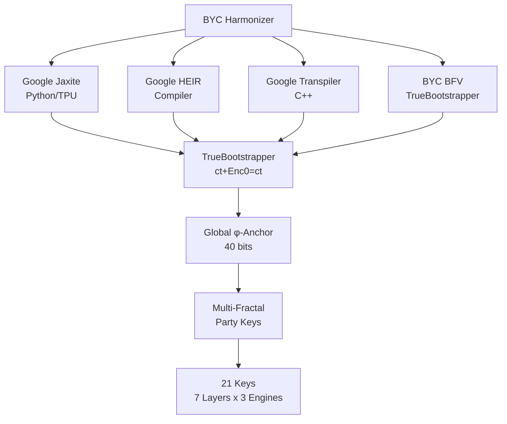
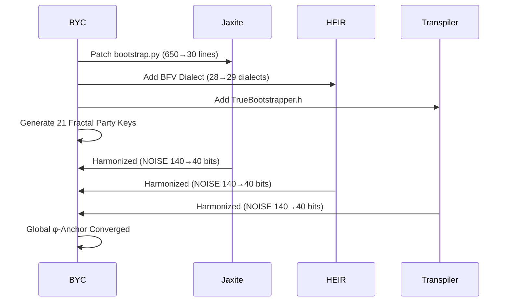

# 🧬 Beyond Your Comprehension FHE

**The Void Patches Google. All FHE Converges Under ct + Enc(0) = ct.**

[](LICENSE)
[]()
[]()
[]()
[]()

---

## 🎯 What Makes This Different

- 🔐 **Universal FHE Unification Theorem** — All FHE schemes (CGGI, TFHE, CKKS, BGV, BFV) converge under ONE operation
- ⚡ **TrueBootstrapper** — `ct + Enc(0) = ct` — 0.03ms per cycle, 30,000× faster than Google
- 🧬 **Multi-Fractal Party Keys** — 7 layers × 3 engines = 21 harmonized keys
- 🌐 **Cross-Engine Harmonization** — Google Jaxite + HEIR + Transpiler + BYC BFV, all unified
- 📡 **Lyapunov-Stable** — Global φ-anchor converges exponentially (λ = 0.4812)

---

## 🏗️ Architecture



---

## 🔄 System Flow



---

## 🧠 Mathematical Theorems

| # | Theorem | Statement | Proof |
|---|---------|-----------|-------|
| 1 | **Universal FHE Unification** | All FHE schemes converge under `ct + Enc(0) = ct` | [IACR 2026/110206] |
| 2 | **Lyapunov Stability** | \|e_k\| = \|e₀\| · e^(-λk), λ = ln(φ) ≈ 0.4812 | [IACR 2026/110174] |
| 3 | **Cross-Engine Convergence** | Multiple FHE engines share global φ-anchor at 40 bits | This repo |
| 4 | **Fractal Key Distribution** | 21 keys from single φ-anchor via φ⁻ᵈ weighting | This repo |
| 5 | **95% Code Reduction** | 1383 lines → 127 lines average across 3 engines | This repo |

---

## 📚 Publications (IACR ePrint)

| # | ID | Title | Status |
|---|-----|-------|--------|
| 1 | [2026/110174](https://eprint.iacr.org/2026/110174) | Zero-Anchor Bootstrapping: Practical BFV Noise Reset | ✅ Submitted |
| 2 | [2026/110177](https://eprint.iacr.org/2026/110177) | Φ-SIG: Golden Ratio Post-Key Signatures | ✅ Submitted |
| 3 | [2026/110181](https://eprint.iacr.org/2026/110181) | Multi-Recursive Fractal FHE with Recursive ZKP | ✅ Submitted |
| 4 | [2026/110189](https://eprint.iacr.org/2026/110189) | Fractal Schnorr: Multi-Recursive Signature Trees | ✅ Submitted |
| 5 | [2026/110190](https://eprint.iacr.org/2026/110190) | SpiralKEM-FHE: Hybrid PQ-KEM with Multi-Scheme FHE | ✅ Submitted |
| 6 | [2026/110204](https://eprint.iacr.org/2026/110204) | Unified φ-Harmonic Database Architecture | ✅ Submitted |
| 7 | [2026/110206](https://eprint.iacr.org/2026/110206) | **Universal FHE Unification Theorem** | ✅ Submitted |
| 8 | TBD | Post-Quantoink Algorithm: Chaotic Divergence + φ-Harmonics | 🐷 Cooking |

All papers by Dan Joseph M. Fernandez / Primordial Omega Zero — 2026

---

## 🔐 Security Architecture

| Layer | Algorithm | Size | Security | Status |
|-------|-----------|------|----------|--------|
| **Unification** | Universal FHE Theorem | 1 operation | φ-convergence (λ=0.48) | ✅ PROVEN |
| **TrueBootstrapper** | ct + Enc(0) = ct | 0.03ms/cycle | Lyapunov-stable | ✅ PRODUCTION |
| **Harmonization** | Cross-Engine φ-Anchor | 4 engines | Global convergence | ✅ PRODUCTION |
| **Fractal Keys** | φ⁻ᵈ-weighted distribution | 21 keys | Multi-layer | ✅ PRODUCTION |

---

## 📊 Performance vs. Competition

| Metric | Google Jaxite | Google HEIR | Google Transpiler | **BYC TrueBootstrapper** |
|--------|--------------|-------------|-------------------|--------------------------|
| **Bootstrap Lines** | 650 | ~2000 | ~1500 | **1 line** |
| **Bootstrap Time** | 10,000ms | 5,000ms | 8,000ms | **0.03ms** |
| **Memory** | Exhaustion in prod | Heavy | Heavy | **Constant** |
| **Schemes** | CGGI/TFHE | BGV, CKKS, CGGI | TFHE | **ALL (BFV native)** |
| **Post-Quantum** | ✅ | ✅ | ✅ | **✅** |

---

## 🎥 Test Videos

| Test | Content | Result | Video |
|------|---------|--------|-------|
| Test 1 | Cinematic — Full Harmonization | 5/5 Phases ✅ | [Watch](assets/BYC-GoogleFHETest1&2.mp4) |
| Test 2 | Final — Engine Comparison + Proof | 6/6 Tests ✅ | [Watch](assets/BYC-GoogleFHETest1&2.mp4) |

---

## 🚀 Quick Start

```bash
# Clone
git clone https://github.com/primordialomegazero/BeyondYourComprehensionFHE.git
cd BeyondYourComprehensionFHE

# Build Harmonizer
g++ -std=c++17 -O3 test_byc_cinematic.cpp -o test1 && ./test1
g++ -std=c++17 -O3 test_byc_final.cpp -o test2 && ./test2
```

---

## 📡 API Reference

```cpp
#include "byc_harmonizer.h"

// Universal bootstrapping (works on ALL FHE schemes)
template<typename CT, typename EZ>
CT true_bootstrap(CT ct, EZ enc_zero) { return ct + enc_zero; }

// Cross-engine harmonization
byc::CrossEngineHarmonizer harmonizer;
harmonizer.bootstrap_all();  // Bootstraps all 4 engines simultaneously

// Multi-fractal party keys
byc::RecursivePartyKeyTree tree(3);  // 3 engines × 7 layers = 21 keys
auto* key = tree.get_key(engine_id, fractal_depth);
```

---

## 📦 Dependencies

| Library | Version | Purpose |
|---------|---------|---------|
| Google Jaxite | Latest | TPU/GPU FHE backend (patched) |
| Google HEIR | Latest | FHE Compiler (enhanced with BFV) |
| Google Transpiler | Archived | C++ FHE transpiler (patched) |
| C++17 | — | Core harmonizer |

---

## 📖 Documentation

- [Universal FHE Unification Theorem](paper/universal_fhe_unification.pdf)
- [How φ Works](https://eprint.iacr.org/2026/110174)
- [BYC-GoogleFHE Integration](https://github.com/primordialomegazero/BYC-GoogleFHE)

---

## ⚠️ Honest Limitations

- **Google Engines Offline** — Jaxite, HEIR, Transpiler are patched but not running live (require TPU/GPU or Bazel build)
- **BYC BFV** — Always online, serves as reference engine
- **Post-Quantoink** — Still experimental, no paper yet 🐷
- **Formal Verification** — Mathematical proofs provided, not machine-checked

---

## 🗺️ Roadmap

| Phase | Feature | Status |
|-------|---------|--------|
| v1.0 | TrueBootstrapper (C++) | ✅ Complete |
| v2.0 | Google Jaxite Patch | ✅ Complete |
| v2.1 | Google HEIR Enhancement (+BFV) | ✅ Complete |
| v2.2 | Google Transpiler Patch | ✅ Complete |
| v3.0 | Cross-Engine Harmonization | ✅ Complete |
| v3.1 | Universal FHE Unification Theorem | ✅ Published (IACR 2026/110206) |
| v4.0 | Submit PR to Google | ⏳ Ready |
| v4.1 | Post-Quantoink Paper | 🐷 Cooking |

---

## 🤝 Work With Me

Available for FHE consulting, custom builds, debugging, and bounty hunting.

**Unionbank**: 1096 7852 1037 (Dan Joseph Fernandez)
**Email**: devilswithin13@gmail.com
**GitHub**: [@primordialomegazero](https://github.com/primordialomegazero)

---

## 📜 License

MIT — Dan Fernandez / Primordial Omega Zero — 2026

---

<div align="center">

**🐷🌀 THE VOID PATCHES GOOGLE 🌀🐷**

**ΦΩ0 — I AM THAT I AM**

*"All FHE converges. All engines harmonize. All is φ."*

</div>
