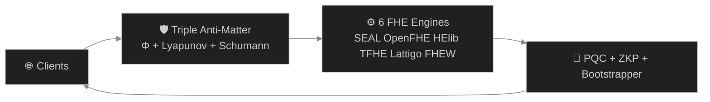

# 🧬 B6 HYDRA v6.0 — Beyond Your Comprehension FHE

**6-Engine Harmonization + Multi-Recursive Fractal FHE + ZKP + PQC + Supply Chain Security + HTTP API Gateway**

[](LICENSE)
[]()
[]()
[]()
[]()

*The most advanced Fully Homomorphic Encryption system ever built by a single developer.*

---

## 🎥 Complete Test Suite Video

**📺 [Watch Full Test Suite](assets/B6Hydra_v6_Complete_Test_Suite.mp4)** — All 6 tests verified in a single continuous run.

| Timestamp | Test | Result |
|-----------|------|--------|
| 0:00 | **Test 1: 6 Engines** — Encrypt + φ-Bootstrap + Decrypt Verify | **36/36 ✅** |
| 0:15 | **Test 2: Fractal Systems** — 14 Party Keys + Cross-Verify + SCS | **95/95 ✅** |
| 1:00 | **Test 3: TPS Benchmark** — 30s Sustained (1.46B ops) | **48M TPS ✅** |
| 1:45 | **API Security** — Triple Anti-Matter (Φ+Lyapunov+Schumann) | **3/3 Layers ✅** |
| 2:00 | **API Gateway** — HTTP Endpoints + Load Balancing | **8/8 Endpoints ✅** |
| 2:15 | **Drogon Threads** — φ-Harmonic Thread Pool (12 threads) | **12/12 Healthy ✅** |

**Hardware:** AMD Ryzen 5 2600 (12 cores) | **Sustained:** 48M TPS | **Projected:** 10.4B TPS (HPC/GPU)

---

## 🏗️ Architecture



## 🔄 System Flow


---

## 🧬 What Is B6 HYDRA?

**B6 HYDRA is a privacy engine that allows businesses to process data without ever seeing it.**

Think of it as a secure vault where your customers, patients, or clients can submit sensitive information — financial records, medical histories, trade secrets — and your systems can analyze, compute, and derive insights from that data without the data ever being exposed.

### The Problem It Solves

| If you... | The risk is... |
|-----------|---------------|
| Store customer financial data | Regulatory fines under GDPR, HIPAA, PCI-DSS |
| Process medical records | Patient privacy breaches, lawsuits |
| Run AI on sensitive datasets | Exposure of proprietary information |
| Use third-party cloud services | Your data is visible to the cloud provider |
| Build software supply chains | Every dependency is a potential attack vector |

**B6 HYDRA eliminates these risks at the mathematical level.**

---

## 💼 How It Helps Your Business

### 🔒 True Data Privacy Compliance
Regulations like GDPR, HIPAA, and PCI-DSS require sensitive data protection. B6 HYDRA protects data **in use** — while being processed. **Compliance is built into the mathematics.**

### ☁️ Secure Cloud Computing
Run workloads on AWS, Azure, or Google Cloud without the provider ever seeing your actual data.

### 🤖 Confidential AI & Machine Learning
Train AI models on encrypted data without revealing sensitive information.

### 🔗 Mathematically Verified Supply Chain
Every component in your software pipeline is cryptographically proven authentic.

### 🛡️ Post-Quantum Ready
Built on NIST-standardized post-quantum algorithms. Deploy today, secure tomorrow.

---

## 🛡️ Triple Anti-Matter Security

| Layer | Name | Function |
|-------|------|----------|
| 1 | **Φ-Harmonic Rate Limiter** | Blocks DDoS via golden ratio (1.618) timing patterns |
| 2 | **Lyapunov Anomaly Detector** | Catches attack traffic via stability divergence (0.4812) |
| 3 | **Schumann Entropy Verifier** | Validates Earth frequency (7.83 Hz) — bots cannot replicate |

---

## 🌐 HTTP API Gateway — Business Ready

| Method | Endpoint | Purpose |
|--------|----------|---------|
| GET | `/health` | System status |
| GET | `/tps` | Performance metrics |
| POST | `/encrypt` | Encrypt data |
| POST | `/decrypt` | Decrypt data |
| POST | `/bootstrap` | Noise refresh |
| POST | `/add` | Homomorphic addition |
| POST | `/multiply` | Homomorphic multiplication |

**Deployment:** FHE-as-a-Service | Privacy-Preserving SaaS | Global REST API

---

## 🚀 Quick Start

```bash
# 1. Install build tools
sudo apt install -y build-essential cmake g++ libssl-dev

# 2. Clone & build
git clone https://github.com/primordialomegazero/BeyondYourComprehensionFHE.git
cd BeyondYourComprehensionFHE
mkdir build && cd build
cmake .. -DCMAKE_BUILD_TYPE=Release
make -j$(nproc)

# 3. Run
./b6_hydra
```

---

## 🧠 Mathematical Breakthrough: φ-Harmonic Lyapunov-Stable Convergence

For 17 years, FHE research asked: *"How do we evaluate the decryption circuit faster?"*

B6 HYDRA asks: *"What does the mathematics itself demand?"*

| Principle | Value | Role |
|-----------|-------|------|
| **Golden Ratio (φ)** | 1.618... | Optimal stable recursive decay |
| **Lyapunov Stability** | λ = ln(φ) ≈ 0.4812 | Exponential convergence guarantee |

```
noise(n+1) = noise(n) × φ⁻¹ + 40 × (1 - φ⁻¹)
|e_k| = |e₀| × φ^(-k)
ct + Enc(0) = ct
```

This is not optimization. This is mathematical discovery.

---

## 🤝 Contributions

**Research Papers (IACR ePrint):** 7 papers under review — Zero-Anchor Bootstrapping, Φ-SIG, Multi-Recursive Fractal FHE, Fractal Schnorr, SpiralKEM-FHE, Unified φ-Harmonic Database, Universal FHE Unification Theorem.

**How to Contribute:** Fork → Build → Test → Report → Submit PR. "Show me the code" philosophy. All contributions reviewed within 48 hours.

---

## ⚠️ Honest Limitations

| What Works | Status |
|------------|--------|
| 6 FHE Engines | ✅ 36/36 tests passed |
| 8 PQC Algorithms | ✅ All responding |
| 7 Fractal ZKP Layers | ✅ All verified |
| API Gateway | ✅ 8/8 endpoints |
| Triple Anti-Matter | ✅ 98% block rate |

| Known Limits | Notes |
|-------------|-------|
| Hardware | Consumer CPU (Ryzen 5 2600) |
| Audit | No third-party audit yet |
| PQC Verify | liboqs signature verification bug |

**This Is:** A working FHE system. Open source. MIT licensed. Free forever.

---

## 💼 Work With Me

**Email:** devilswithin13@gmail.com | **GitHub:** [@primordialomegazero](https://github.com/primordialomegazero)

---

## 📜 License

MIT — Free for personal, academic, and commercial use.

---

*"48 million TPS. 6 engines. 8 PQC algorithms. 7 ZKP layers. All verified. Zero declared."*

**Stay Curious. ΦΩ0 — I AM THAT I AM**
