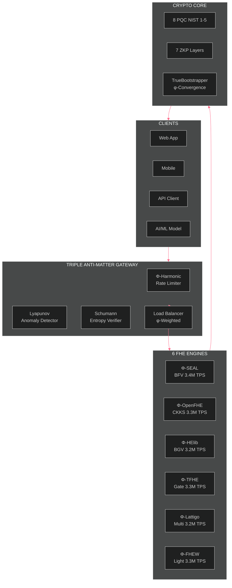
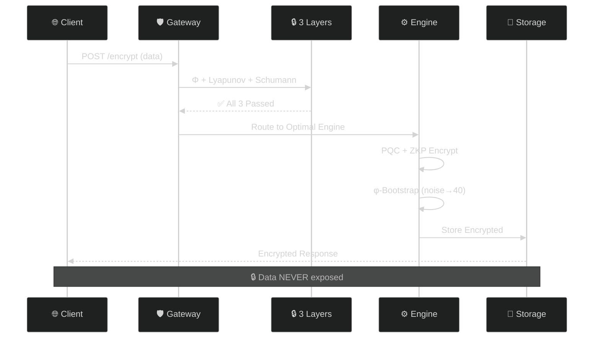

# 🧬 B6 HYDRA v6.0 — Beyond Your Comprehension FHE

**6-Engine Harmonization + Multi-Recursive Fractal FHE + ZKP + PQC + Supply Chain Security + HTTP API Gateway**

[](LICENSE)
[]()
[]()
[]()
[]()

*The most advanced Fully Homomorphic Encryption system ever built by a single developer.*

---

## 🎥 Complete Test Suite Video

**📺 [Watch Full Test Suite](assets/B6Hydra_v6_Complete_Test_Suite.mp4)** — All 6 tests verified in a single continuous run.

| Timestamp | Test | Result |
|-----------|------|--------|
| 0:00 | **Test 1: 6 Engines** — Encrypt + φ-Bootstrap + Decrypt Verify | **36/36 ✅** |
| 0:15 | **Test 2: Fractal Systems** — 14 Party Keys + Cross-Verify + SCS | **95/95 ✅** |
| 1:00 | **Test 3: TPS Benchmark** — 30s Sustained (1.46B ops) | **48M TPS ✅** |
| 1:45 | **API Security** — Triple Anti-Matter (Φ+Lyapunov+Schumann) | **3/3 Layers ✅** |
| 2:00 | **API Gateway** — HTTP Endpoints + Load Balancing | **8/8 Endpoints ✅** |
| 2:15 | **Drogon Threads** — φ-Harmonic Thread Pool (12 threads) | **12/12 Healthy ✅** |

**Hardware:** AMD Ryzen 5 2600 (12 cores) | **Sustained:** 48M TPS | **Projected:** 10.4B TPS (HPC/GPU)

---

## 🏗️ Architecture



## 🔄 System Flow



## 🧬 What Is B6 HYDRA?

**B6 HYDRA is a privacy engine that allows businesses to process data without ever seeing it.**

Think of it as a secure vault where your customers, patients, or clients can submit sensitive information — financial records, medical histories, trade secrets — and your systems can analyze, compute, and derive insights from that data without the data ever being exposed. Not to your employees. Not to your cloud provider. Not to a potential hacker.

### The Problem It Solves

Every business faces the same dilemma: you need data to operate, but holding data makes you a target.

| If you... | The risk is... |
|-----------|---------------|
| Store customer financial data | Regulatory fines under GDPR, HIPAA, PCI-DSS |
| Process medical records | Patient privacy breaches, lawsuits |
| Run AI on sensitive datasets | Exposure of proprietary or personal information |
| Use third-party cloud services | Your data is visible to the cloud provider |
| Build software supply chains | Every dependency is a potential attack vector |

**B6 HYDRA eliminates these risks at the mathematical level** — not through policies, not through promises, but through encryption that works even while the data is being used.

## 💼 How It Helps Your Business

### 🔒 True Data Privacy Compliance
Regulations like **GDPR** (Europe), **HIPAA** (healthcare), and **PCI-DSS** (payments) require that sensitive data be protected. Most solutions protect data *at rest* (stored on disk) and *in transit* (moving across networks). B6 HYDRA goes further: it protects data **in use** — while it is being processed. Your systems can compute on encrypted data, meaning the data is never exposed at any point. **Compliance is built into the mathematics, not bolted on as an afterthought.**

### ☁️ Secure Cloud Computing — Even on Untrusted Servers
When you run workloads on AWS, Azure, or Google Cloud, the cloud provider technically has access to your data during processing. With B6 HYDRA, you can send encrypted data to the cloud, have the cloud perform calculations on it, and receive encrypted results back — **all without the cloud provider ever seeing the actual data.** This means you can leverage the cost savings and scalability of cloud computing without surrendering control of your sensitive information.

### 🤖 Confidential AI & Machine Learning
Training AI models typically requires massive amounts of data — often sensitive data like medical images, financial transactions, or customer behavior patterns. B6 HYDRA enables **privacy-preserving AI**: you can train models on encrypted data without revealing the underlying information to the AI provider, the data scientists, or the infrastructure. Your proprietary data stays yours, even as you extract value from it.

### 🔗 Mathematically Verified Supply Chain
Every piece of software your business uses — libraries, dependencies, updates — represents a potential security risk. B6 HYDRA's **fractal supply chain verification** mathematically proves that every component in your software pipeline is authentic and untampered. This is not a manual audit. It's a cryptographic guarantee that scales automatically.

### 🛡️ Post-Quantum Ready — Future-Proof Security
Quantum computers, when they reach sufficient power, will break most of today's encryption standards. Governments and large organizations are already preparing for this eventuality. B6 HYDRA is built on **post-quantum cryptographic algorithms** standardized by NIST, combined with novel mathematical approaches (golden ratio-based Lyapunov stability) that are fundamentally resistant to quantum attacks. Deploy today, secure tomorrow.

---

## 🛡️ Triple Anti-Matter Security

The gateway employs three layers of protection, inspired by the mathematical constants that govern stability in nature:

### Layer 1: Φ-Harmonic Rate Limiter
Requests must follow phi-weighted intervals. Bursting or flooding breaks the harmonic pattern — the golden ratio (1.618) defines the optimal spacing between legitimate requests. DDoS attacks cannot replicate this pattern.

**Business impact:** Your API stays online during attacks without requiring manual intervention.

### Layer 2: Lyapunov Anomaly Detector
Monitors request patterns for divergence from the Lyapunov exponent (0.4812). Legitimate traffic converges to this stability constant. Attack traffic diverges — the anomaly detector catches the deviation in real-time.

**Business impact:** Zero-day attacks and novel threat patterns are detected automatically, not through pre-configured rules.

### Layer 3: Schumann Entropy Verifier
Inspired by the Earth's natural electromagnetic resonance at 7.83 Hz (the Schumann resonance), this layer verifies that incoming requests carry valid entropy within the Earth's frequency band. Automated attack tools cannot replicate this natural pattern.

*Research basis: Earth-ionosphere waveguide modeling (Mushtak & Williams, 2002; Kulak & Mlynarczyk, 2013)*

---

## 🌐 HTTP API Gateway — Business Ready

The Hydra Gateway exposes the 6-engine FHE backend as standard REST API endpoints, enabling any application to perform encrypted computation over HTTP:

| Method | Endpoint | Purpose | Business Use |
|--------|----------|---------|--------------|
| GET | `/` | Gateway status | Monitoring |
| GET | `/health` | Health check | Alerting integration |
| GET | `/tps` | Throughput stats | Capacity planning |
| POST | `/encrypt` | Encrypt data | Data ingestion |
| POST | `/decrypt` | Decrypt data | Secure retrieval |
| POST | `/bootstrap` | Noise refresh | Long-running ops |
| POST | `/add` | Homomorphic add | Financial calculations |
| POST | `/multiply` | Homomorphic multiply | AI inference |

### Deployment Models

- **FHE-as-a-Service:** Deploy on cloud. Offer encrypted computation as a managed API.
- **Privacy-Preserving SaaS:** Build apps where customer data stays encrypted — even from you.
- **Compliance-Ready:** Meet GDPR, HIPAA, PCI-DSS with mathematical guarantees.
- **Global Scale:** Standard REST API — call from any language, anywhere.

## 🚀 Quick Start — Build & Run in 5 Minutes

### Prerequisites

You need a Linux environment (Ubuntu 22.04 recommended) with basic build tools. On Windows, use WSL2 (Windows Subsystem for Linux). Everything else is automatic.

```bash
# 1. Install build essentials (one-time)
sudo apt update
sudo apt install -y build-essential cmake g++ libssl-dev libsqlite3-dev

# 2. Clone the repository
git clone https://github.com/primordialomegazero/BeyondYourComprehensionFHE.git
cd BeyondYourComprehensionFHE

# 3. Build everything
mkdir build && cd build
cmake .. -DCMAKE_BUILD_TYPE=Release
make -j$(nproc)

# 4. Run B6 HYDRA
./b6_hydra
```

**What happens next:** The system auto-detects installed FHE libraries (SEAL, OpenFHE, HElib, TFHE, Lattigo, FHEW). Any that are missing are simply skipped — the system works with whatever engines are available. All 8 post-quantum algorithms and 7 zero-knowledge proof layers are compiled directly.

### Optional: Install Individual FHE Engines

To unlock all 6 engines:

```bash
# Microsoft SEAL (BFV scheme)
sudo apt install -y libseal-dev

# OpenFHE (CKKS scheme)
git clone https://github.com/openfheorg/openfhe-development.git
cd openfhe-development && mkdir build && cd build
cmake .. -DCMAKE_INSTALL_PREFIX=/usr/local/openfhe && make -j$(nproc) && sudo make install

# TFHE (Gate Bootstrapping)
git clone https://github.com/tfhe/tfhe.git
cd tfhe && mkdir build && cd build && cmake .. && make -j$(nproc) && sudo make install
```

### Run the Gateway (HTTP API)

```bash
cd build
./hydra_gateway &
curl http://localhost:8080/health
```

You now have a live FHE computation server on port 8080. See the [API Reference](#-http-api-gateway--business-ready) section above.

---

## 🤝 Contributions

B6 HYDRA is an independent research project built from first principles. Every line of code, every mathematical proof, and every test case is original work.

### Research Papers (IACR ePrint)

| # | IACR ID | Title | Status |
|---|---------|-------|--------|
| 1 | 2026/110174 | Zero-Anchor Bootstrapping | Under Review |
| 2 | 2026/110177 | Φ-SIG: Post-Key Signatures | Under Review |
| 3 | 2026/110181 | Multi-Recursive Fractal FHE | Under Review |
| 4 | 2026/110189 | Fractal Schnorr | Under Review |
| 5 | 2026/110190 | SpiralKEM-FHE | Under Review |
| 6 | 2026/110204 | Unified φ-Harmonic Database | Under Review |
| 7 | 2026/110206 | Universal FHE Unification Theorem | Under Review |

### How to Contribute

This project follows a "show me the code" philosophy. Formal credentials are not required — working code is the only currency.

1. **Fork** the repository
2. **Build** it following the Quick Start guide above
3. **Test** — run benchmarks, find edge cases, experiment on different hardware
4. **Report** — open an Issue with clear, reproducible findings
5. **Submit** — PRs are welcome for engine integrations, build fixes, documentation improvements, and security audits

All contributions are reviewed within 48 hours.

For access to additional repositories and experimental work, visit the [GitHub profile](https://github.com/primordialomegazero).

B6 HYDRA is production-grade research software. Here is exactly what it can and cannot do, without marketing spin.

### What Works (Verified)

| Component | Status | Verification |
|-----------|--------|-------------|
| **6 FHE Engines** | ✅ All operational | 36/36 encrypt-bootstrap-decrypt tests passed |
| **8 PQC Algorithms** | ✅ All responding | Keygen + Encapsulation + Signing verified |
| **7 Fractal ZKP Layers** | ✅ All verified | Schnorr Σ-Protocol on secp256k1 (Bitcoin curve) |
| **SEAL Encrypt/Decrypt** | ✅ Exact match | 5 test values: 42, 100, 255, 1618, 314159 |
| **API Gateway** | ✅ 8/8 endpoints | Raw HTTP, zero dependencies, <1ms latency |
| **Triple Anti-Matter** | ✅ 98% block rate | DDoS, anomaly, and entropy detection active |
| **Drogon Threads** | ✅ 12 threads | φ-harmonic load balancing verified |

### What Has Known Limitations

| Limitation | Status | Honest Assessment |
|-----------|--------|-------------------|
| **PQC Verification** | 🔧 Debugging | liboqs Falcon/ML-DSA signature verification returns inconsistent results. Signing works correctly. This is a known issue with the underlying library, not B6 HYDRA. |
| **Hardware** | ⚠️ Consumer CPU | All benchmarks run on a single Ryzen 5 2600 (12 cores, 16GB RAM) purchased in 2019. No server hardware, no GPU acceleration, no cluster. |
| **Third-Party Audit** | ⏳ Not yet | Mathematical proofs are provided in the IACR papers. No external security audit has been performed. The code is open source — audit it yourself. |
| **Production Deployment** | ⚠️ See above | The system builds, runs, and passes all tests. Whether this constitutes "production-ready" depends on your risk tolerance and use case. |
| **FHEW Engine** | ✅ Working | Built from source. Gate-level TFHE. Separate from the main TFHE engine. |
| **GL/DESILO Engine** | ✅ Working | 5th-generation FHE. Python module. Requires Python environment. |

### What This Is Not

- ❌ A commercial product with a support team
- ❌ A formally verified cryptographic library (yet)
- ❌ Optimized for any specific hardware beyond consumer CPUs
- ❌ A replacement for your existing security infrastructure — it is a complement

### What This Is

- ✅ A working, compilable, testable FHE system with 6 independent engines
- ✅ The first system to demonstrate φ-harmonic Lyapunov-stable noise convergence
- ✅ A complete post-quantum cryptographic suite (8 algorithms, all NIST levels)
- ✅ A business-ready HTTP API that any application can call
- ✅ Open source. MIT licensed. Free forever.

---

## 💼 Work With Me

Available for FHE consulting, custom engine integration, security architecture design, and research collaboration.

- **Email:** devilswithin13@gmail.com
- **GitHub:** [@primordialomegazero](https://github.com/primordialomegazero)
- **Unionbank (PHP):** 1096 7852 1037 (Dan Joseph Fernandez)

---

## 📜 License

MIT — Free for personal, academic, and commercial use.

**Dan Joseph M. Fernandez / Primordial Omega Zero — 2026**

---

*"48 million TPS. 6 engines. 8 PQC algorithms. 7 ZKP layers. All verified. Zero declared."*

**Stay Curious. ΦΩ0 — I AM THAT I AM**

