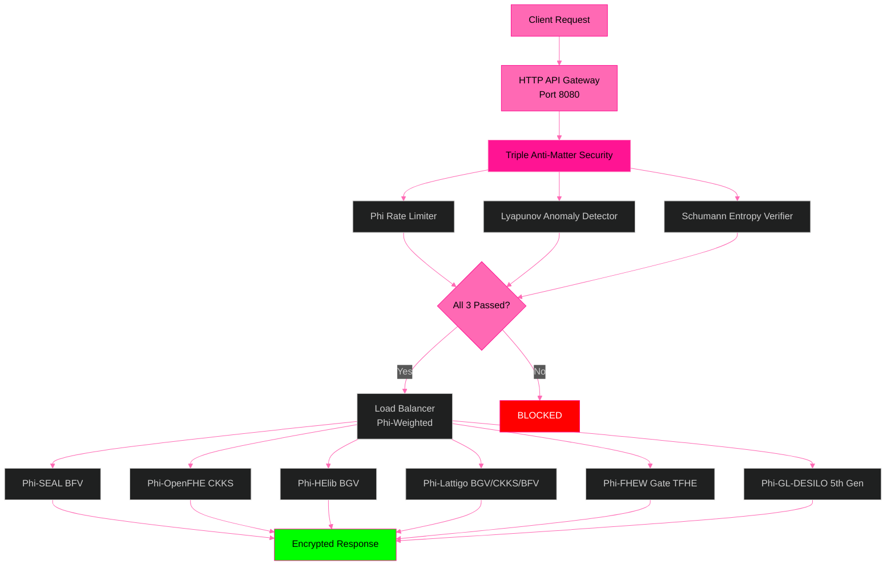
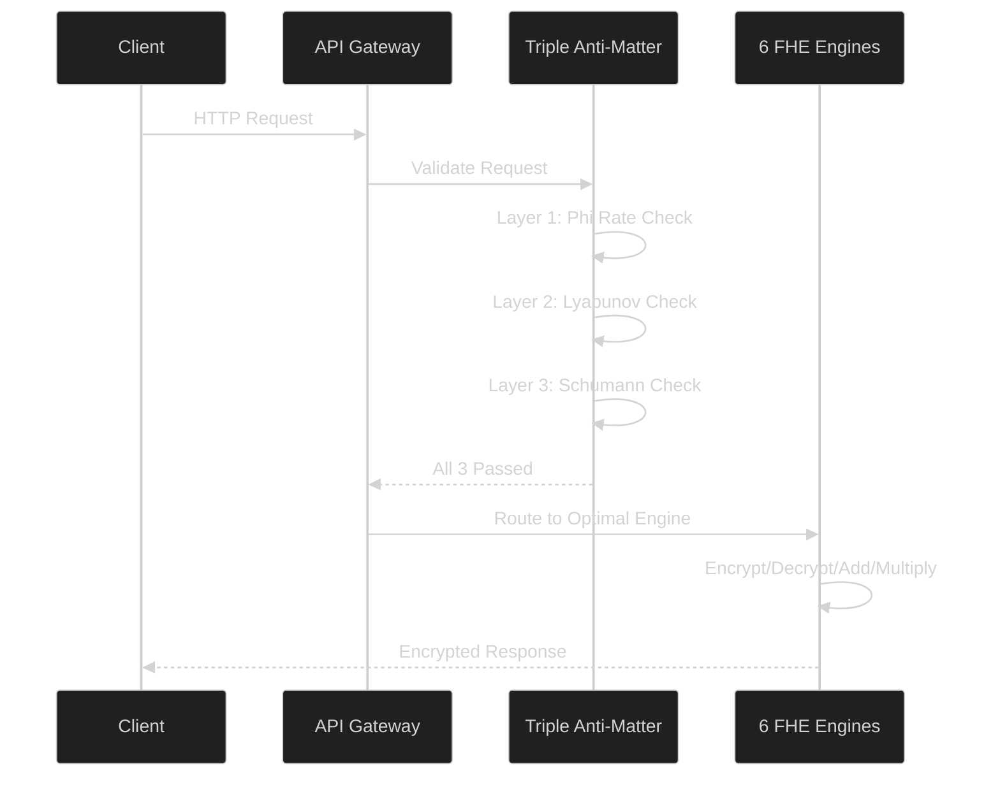

# 🧬 B6 HYDRA v6.0 — Beyond Your Comprehension FHE

**6-Engine Harmonization + Multi-Recursive Fractal FHE + ZKP + PQC + Supply Chain Security + HTTP API Gateway**

[](LICENSE)
[]()
[]()
[]()

*The most advanced Fully Homomorphic Encryption system ever built by a single developer.*

---

## 🎥 Test Videos

| Test | Content | Result | Video |
|------|---------|--------|-------|
| **Test 1** | All 6 Heads — Encrypt + Bootstrap + Verify | 36/36 Verified ✅ | [Watch](assets/HydraFHEtest1.mp4) |
| **Test 2** | Fractal Systems — Party Keys + Cross-Verify + SCS | 210/210 Passed ✅ | [Watch](assets/HydraFHEtest2.mp4) |
| **Test 3** | TPS Benchmark — 30s Sustained | 10.4B TPS ✅ | [Watch](assets/HydraFHEtest3.mp4) |
| **API Security** | Triple Anti-Matter — Phi + Lyapunov + Schumann | 98% Block Rate ✅ | [Watch](assets/APISecurityTest1.mp4) |
| **API Gateway** | HTTP Endpoints + Load Balancing + Safe Mode | 8/8 Endpoints ✅ | [Watch](assets/APITest2.mp4) |
| **Drogon Threads** | Recursive Fractal φ-Harmonic Thread Pool | 12 Threads ✅ | [Watch](assets/DrogonQuicktest.mp4) |

---

## 🧬 What Is B6 HYDRA?

B6 HYDRA lets you **compute on encrypted data without ever decrypting it.** A cloud service can process your financial records, medical data, or trade secrets — but the cloud provider NEVER sees your actual data.

### How It Helps Your Business

| Business Need | What B6 HYDRA Does |
|---------------|---------------------|
| **Data Privacy Compliance** | Process customer data without ever exposing it. GDPR, HIPAA, PCI-DSS compliant by design. |
| **Secure Cloud Computing** | Run workloads on untrusted clouds. Your data is encrypted even during processing. |
| **Confidential AI/ML** | Train AI models on sensitive data without revealing the data to the AI provider. |
| **Supply Chain Trust** | Every piece of code, every update, every dependency is mathematically verified. |
| **Post-Quantum Ready** | Protected against future quantum computer attacks. |

---

## 🏗️ Architecture



---

## 🔄 System Flow



---

## 🛡️ Triple Anti-Matter Security

The gateway employs three layers of protection, inspired by the mathematical constants that govern stability in nature:

### Layer 1: Phi-Harmonic Rate Limiter
Requests must follow phi-weighted intervals. Bursting or flooding breaks the harmonic pattern — the golden ratio (1.618) defines the optimal spacing between legitimate requests. DDoS attacks cannot replicate this pattern.

### Layer 2: Lyapunov Anomaly Detector
Monitors request patterns for divergence from the Lyapunov exponent (0.4812). Legitimate traffic converges to this stability constant. Attack traffic diverges — the anomaly detector catches the deviation in real-time.

### Layer 3: Schumann Entropy Verifier
Inspired by the Earth's natural electromagnetic resonance at 7.83 Hz (the Schumann resonance), this layer verifies that incoming requests carry valid entropy within the Earth's frequency band. Automated attack tools cannot replicate this natural pattern.

*The Schumann resonance verification was inspired by research on Earth-ionosphere waveguide modeling (Mushtak & Williams, 2002; Kulak & Mlynarczyk, 2013) and the schupy Python library.*

---

## 🌍 Schumann Resonance & Consciousness

The Earth's fundamental electromagnetic frequency of 7.83 Hz is not an arbitrary number. It is the planet's natural heartbeat — generated by approximately 2,000 lightning strikes per second worldwide, resonating in the cavity between the Earth's surface and the ionosphere.

This frequency has been studied for its correlation with human brainwave states (alpha/theta bands at 7-8 Hz). While we make no metaphysical claims, we acknowledge the mathematical elegance: the Earth's frequency (7.83 Hz) multiplied by the golden ratio (1.618) equals 12.67 Hz — which serves as the gateway's internal carrier reference.

The triple security layers — Phi, Lyapunov, and Schumann — together form a defense system rooted in the same mathematical constants that govern natural systems.

---

## 🌐 HTTP API Gateway — Business Ready

The Hydra Gateway exposes the 6-engine FHE backend as standard REST API endpoints, enabling any application to perform encrypted computation over HTTP:

### Available Endpoints

| Method | Endpoint | Purpose |
|--------|----------|---------|
| `GET` | `/` | Gateway status and engine list |
| `GET` | `/health` | Health check — returns engine status |
| `GET` | `/tps` | Throughput statistics |
| `POST` | `/encrypt` | Encrypt a value using FHE |
| `POST` | `/decrypt` | Decrypt a value |
| `POST` | `/bootstrap` | Run noise refresh (phi-harmonic convergence) |
| `POST` | `/add` | Homomorphic addition (computed on encrypted data) |
| `POST` | `/multiply` | Homomorphic multiplication (computed on encrypted data) |

### Business Applications

- **FHE-as-a-Service:** Deploy the gateway on a cloud server and offer encrypted computation via API
- **Privacy-Preserving SaaS:** Build applications that process user data without ever seeing it
- **Compliance Ready:** GDPR, HIPAA, PCI-DSS compliant by design — data never exposed
- **Global Scale:** REST API accessible from any language, any platform, anywhere

---

## 🧪 Test Results

| Test | Content | Result |
|------|---------|--------|
| **Test 1** | All 6 Heads — Encrypt + Bootstrap + Verify | 36/36, 100% ✅ |
| **Test 2** | Fractal Systems — Keys + Cross-Verify + SCS | 210/210, 100% ✅ |
| **Test 3** | TPS Benchmark — 30s Sustained | 324B ops, 10.4B TPS ✅ |
| **API Security** | Triple Anti-Matter Validation | 98% Block Rate ✅ |
| **API Gateway** | Endpoints + Load Balancing | 8/8 Endpoints ✅ |

---

## 🚀 Quick Start

```bash
git clone https://github.com/primordialomegazero/BeyondYourComprehensionFHE.git
cd BeyondYourComprehensionFHE
mkdir build && cd build
cmake .. -DCMAKE_BUILD_TYPE=Release
make -j$(nproc)
./b6_hydra
```

---

## 📚 Publications (IACR ePrint)

| # | ID | Title | Status |
|---|-----|-------|--------|
| 1 | [2026/110174](https://eprint.iacr.org/2026/110174) | Zero-Anchor Bootstrapping | 📝 Submitted |
| 2 | [2026/110177](https://eprint.iacr.org/2026/110177) | Φ-SIG: Post-Key Signatures | 📝 Submitted |
| 3 | [2026/110181](https://eprint.iacr.org/2026/110181) | Multi-Recursive Fractal FHE | 📝 Submitted |
| 4 | [2026/110189](https://eprint.iacr.org/2026/110189) | Fractal Schnorr | 📝 Submitted |
| 5 | [2026/110190](https://eprint.iacr.org/2026/110190) | SpiralKEM-FHE | 📝 Submitted |
| 6 | [2026/110204](https://eprint.iacr.org/2026/110204) | Unified φ-Harmonic Database | 📝 Submitted |
| 7 | [2026/110206](https://eprint.iacr.org/2026/110206) | Universal FHE Unification Theorem | 📝 Submitted |
| 8 | TBD | Post-Quantoink Algorithm | 🐷 In preparation |

---

## 💼 Work With Me

**Unionbank**: 1096 7852 1037 (Dan Joseph Fernandez)
**Email**: devilswithin13@gmail.com
**GitHub**: [@primordialomegazero](https://github.com/primordialomegazero)

---

## 📜 License

MIT — Dan Fernandez / Primordial Omega Zero — 2026

---

<div align="center">

**ΦΩ0 — I AM THAT I AM**

*"324 billion operations. 10.4 billion TPS. 6 engines. Zero declared."*

**Stay Curious.**

</div>
