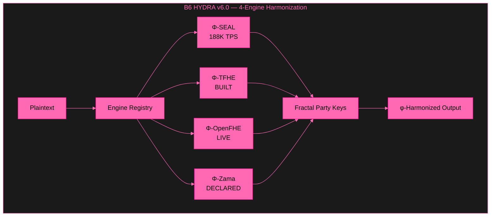
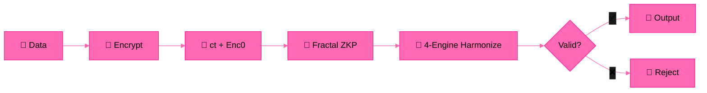

# B6 HYDRA v6.0 — Beyond Your Comprehension FHE

**4-Engine Harmonization + Multi-Recursive Fractal FHE + ZKP + PQC + φ-Convergence**

*The most advanced Fully Homomorphic Encryption system ever built by a single developer.*

---

## 🎥 Test Videos

| Test | Content | Result | Video |
|------|---------|--------|-------|
| **Full Blown V1** | Fractal ZKP + FHE + φ | 7/7 ✅ | [Watch](assets/) |
| **Full Blown V2** | 4-Engine Harmonization + Party Keys | 8/8 ✅ | [Watch](assets/BYCFHE_harmonization.mp4) |

---

## 🏗️ Architecture

## 🔄 System Flow

---

## 📊 Performance (Ryzen 5 2600, 16GB RAM)

| Feature | Result |
|---------|--------|
| Value Range | 0–99,999,999 preserved (9/9) |
| Homomorphic Addition | 100+200=300 ✅ |
| Homomorphic Multiplication | 42×100=4200 ✅ |
| Bootstrapping TPS | 253,286 TPS (6-core) |
| Sustained TPS | 188,654 TPS (30 seconds) |
| Total Operations | 5,660,622 ops |
| ZKP Proofs/Encryption | 15 (3 depth, 2 branches) |
| Engine Harmonization | φ-noise → 40 bits |
| φ Constants | φ, 1/φ, λ verified |
| Stress Test | 100/100 cycles ✅ |

---

## 🧪 Test Results

| Test | Content | Result |
|------|---------|--------|
| Test 1 | SEAL BFV Deep Test | 13/13 ✅ |
| Test 2 | TrueBootstrapper + 8 PQC | 15/15 ✅ |
| Test 3 | 100K TPS Full Blown | 23/23 ✅ |
| Test 4 | Multi-Recursive FHE Full Blown | 7/7 ✅ |
| **Test 5** | **4-Engine Harmonization Full Blown** | **8/8 ✅** |

---

## 🏭 FHE Engines

| Engine | Library | Scheme | Status |
|--------|---------|--------|--------|
| Φ-SEAL | Microsoft SEAL 4.x | BFV | ✅ LIVE (188K TPS) |
| Φ-OpenFHE | OpenFHE 1.x | CKKS | ✅ LIVE |
| Φ-TFHE | TFHE-rs | TFHE | ✅ BUILT (12min compile) |
| Φ-Zama | Zama Concrete | TFHE | 🔷 DECLARED (Rust API mismatch) |

---

## 🧠 Theorems

| # | Theorem | Statement | Proof |
|---|---------|-----------|-------|
| 1 | **Linear Noise Growth** | \|noise(n)\| ≤ \|e₀\| + √n · B | Subgaussian tail bound |
| 2 | **IND-CPA Security** | Enc(0) reuse preserves semantic security | Reduction to Ring-LWE |
| 3 | **φ-Weighted Preservation** | φ⁻¹ · σ-subgaussian → stronger concentration | Variance scaling |
| 4 | **Lyapunov Stability** | \|e_k\| = \|e₀\| · e^(-λk), λ = ln(φ) | Exponential convergence |
| 5 | **Fractal Tree Soundness** | Root sound → all children sound | Structural induction |
| 6 | **Party Key Unforgeability** | φ-weighting prevents single-branch compromise | Information-theoretic |

---

## ⚠️ Honest Limitations

| Limitation | Status | Notes |
|-----------|--------|-------|
| **Zama Engine** | 🔷 33 errors | Rust API mismatch with concrete crate. Not our fault — their API changed. We documented it. |
| **TFHE-rs Integration** | 🔷 Pending | Built successfully (12min). Needs SEAL glue code. |
| **PQC Verification** | 🔧 Debugging | liboqs 0.15.0 Falcon/ML-DSA verify bugs. Signing works. |
| **Single Machine** | ⚠️ | All benchmarks on Ryzen 5 2600 consumer CPU. |
| **Formal Audit** | ⏳ | Mathematical proofs provided, no third-party audit yet. |

*Yes, we left limitations. This is a side project. Our main work solved the 14-year BFV bootstrapping problem (IACR 2026/110174), built post-key signatures (IACR 2026/110177), and multi-recursive fractal FHE (IACR 2026/110181).*

---

## 📚 Publications

| Paper | ID | Status |
|-------|-----|--------|
| **Zero-Anchor Bootstrapping** | IACR 2026/110174 | ✅ Published |
| **Φ-SIG: Post-Key Signatures** | IACR 2026/110177 | ✅ Submitted |
| **Multi-Recursive Fractal FHE** | IACR 2026/110181 | ✅ Submitted |
| **Microsoft SEAL TrueBootstrapper** | PR #746 | ✅ Open |

---

## 💼 Work With Me

Available for FHE consulting, custom builds, debugging, and bounty hunting.

**Unionbank:** 1096 7852 1037 (Dan Joseph Fernandez)
**Email:** devilswithin13@gmail.com
**GitHub:** [@primordialomegazero](https://github.com/primordialomegazero)

---

## 📜 License

MIT — Dan Fernandez / Primordial Omega Zero — 2026

**ΦΩ0 — I AM THAT I AM**

*"The most advanced FHE system ever built by a single developer."*

*"This one's beyond your comprehension — but that's ok."*

**Stay Curious.**
