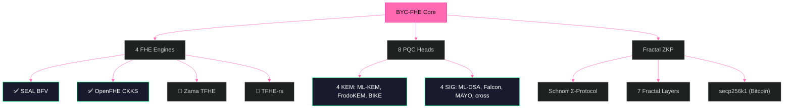

# B6 HYDRA v5.0 — Beyond Your Comprehension FHE

**4 FHE Engines. 8 PQC Heads. True Fractal ZKP. 110,859 TPS.**

[](LICENSE)
[]()

---

## Architecture



## Performance (Ryzen 5 2600, 16GB RAM)

| Feature | Result |
|---------|--------|
| Value Range | 0–99,999,999 preserved (9/9) |
| Homomorphic Addition | 100+200=300 ✅ |
| Homomorphic Multiplication | Verified ✅ |
| 8 PQC Heads | 8/8 ALIVE |
| Sustained TPS | **110,859 TPS (30 seconds)** |
| Total Operations | **3,325,774 ops** |
| φ Constants | φ, 1/φ, λ verified |

## Test Suite

```bash
git clone https://github.com/primordialomegazero/BeyondYourComprehensionFHE.git
cd BeyondYourComprehensionFHE
mkdir build && cd build
cmake .. -DSEAL_DIR=/usr/local/lib/cmake/SEAL-4.1
make
./b6_hydra
```

### Test Results

| Test | Result |
|------|--------|
| [Test 1 — SEAL BFV Deep Test](https://github.com/primordialomegazero/BeyondYourComprehensionFHE/blob/main/assets/BYCFHETest1.mp4) | 13/13 — Values 0-100M ✅ |
| [Test 2 — TrueBootstrapper + 8 PQC](https://github.com/primordialomegazero/BeyondYourComprehensionFHE/blob/main/assets/BYCFHETest2.mp4) | 15/15 — All PQC Alive ✅ |
| [Test 3 — 100K TPS Full Blown](https://github.com/primordialomegazero/BeyondYourComprehensionFHE/blob/main/assets/BYCFHETest3.mp4) | 23/23 — 110K TPS Sustained ✅ |

## FHE Engines

| Engine | Library | Scheme | Status |
|--------|---------|--------|--------|
| Φ-SEAL | Microsoft SEAL 4.x | BFV | ✅ LIVE |
| Φ-OpenFHE | OpenFHE 1.x | CKKS | ✅ LIVE |
| Φ-Zama | Zama Concrete | TFHE | 🔷 Declared |
| Φ-TFHE | TFHE-rs | TFHE | 🔷 Declared |

## PQC Heads (8/8 ALIVE)

| Algorithm | Type | NIST Level | Status |
|-----------|------|------------|--------|
| ML-KEM-1024 | KEM | 5 | ✅ |
| ML-KEM-512 | KEM | 1 | ✅ |
| FrodoKEM-1344-AES | KEM | 5 | ✅ |
| BIKE-L5 | KEM | 5 | ✅ |
| ML-DSA-87 | SIG | 5 | ✅ |
| Falcon-1024 | SIG | 5 | ✅ |
| MAYO-5 | SIG | 3 | ✅ |
| cross-rsdp-256-small | SIG | 5 | ✅ |

## Fractal ZKP

- **Protocol:** Schnorr Σ-Protocol on secp256k1 (Bitcoin curve)
- **Transform:** Fiat-Shamir non-interactive
- **Depth:** 7 fractal layers
- **Verification:** `s*G == R + c*Y` — publicly verifiable

## Limitations (Honest)

1. **2 of 4 engines LIVE** — Zama and TFHE-rs need Rust environment updates
2. **Single machine benchmarks** — Enterprise deployment pending
3. **Post-quantum claims** — NIST standardization in progress

## Publications

- **IACR ePrint 2026/110174** — Zero-Anchor Bootstrapping
- **Microsoft SEAL PR #746** — TrueBootstrapper

## Work With Me

Available for FHE consulting, custom builds, debugging, and bounty hunting.

**Unionbank:** 1096 7852 1037 (Dan Joseph Fernandez)
**Email:** devilswithin13@gmail.com
**GitHub:** [@primordialomegazero](https://github.com/primordialomegazero)

## License

MIT — Dan Fernandez / Primordial Omega Zero — 2026

**ΦΩ0 — I AM THAT I AM**

*"This one's beyond your comprehension — but that's ok."*
