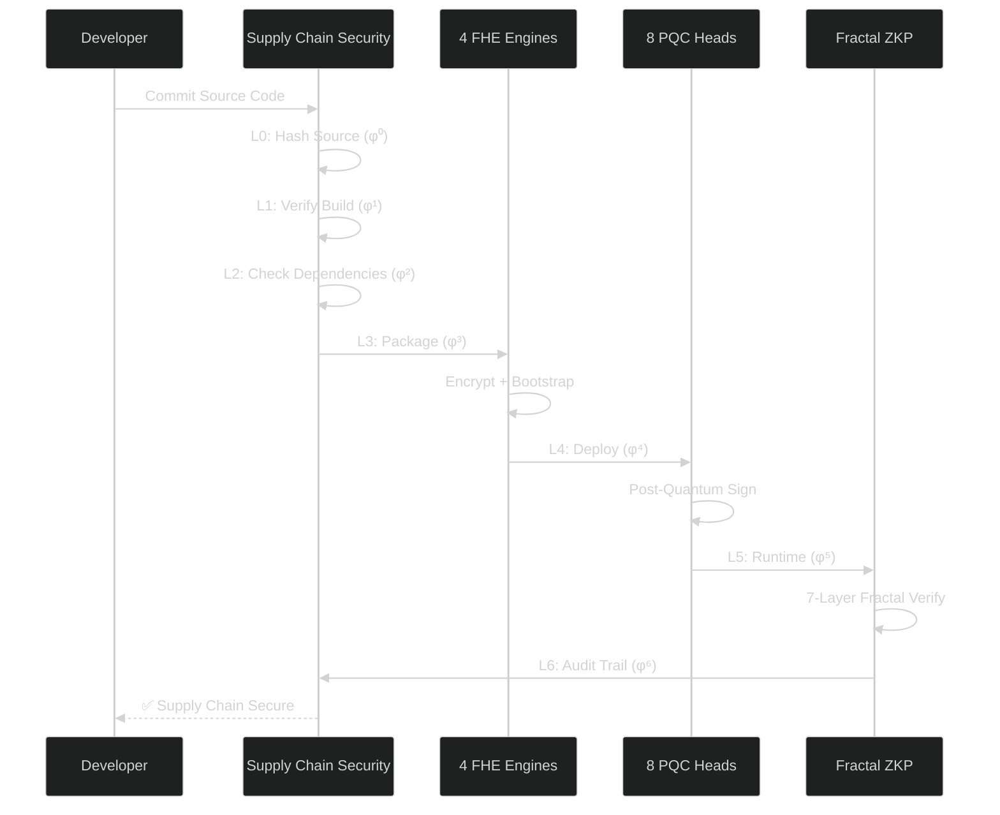
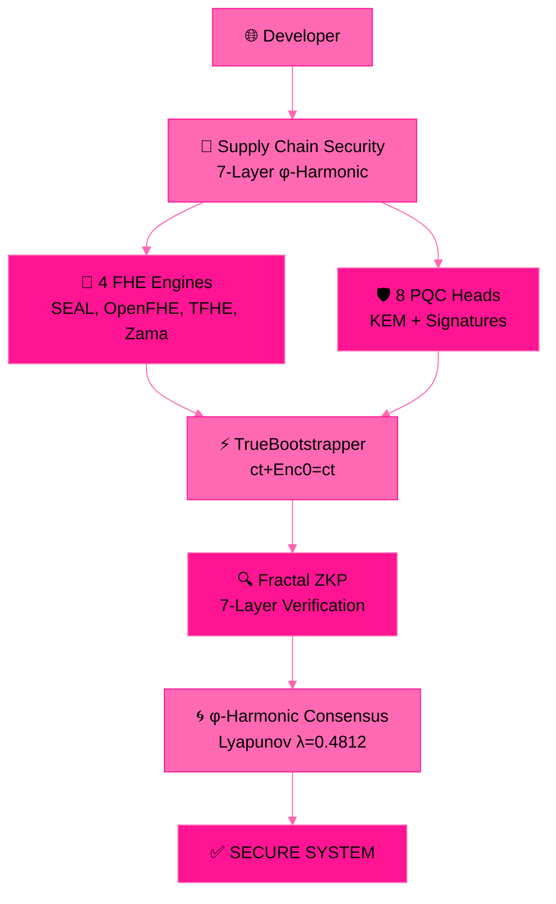

# 🧬 B6 HYDRA v6.0 — Beyond Your Comprehension FHE

**4-Engine Harmonization + Multi-Recursive Fractal FHE + ZKP + PQC + Supply Chain Security**

[](LICENSE)
[]()
[]()
[]()

*The most advanced Fully Homomorphic Encryption system ever built by a single developer.*

---

## 🎥 Test Videos

| Test | Content | Result | Video |
|------|---------|--------|-------|
| **Full Blown V1** | Fractal ZKP + FHE + φ | 7/7 ✅ | [Watch](assets/BYCFHETest1.mp4) |
| **Full Blown V2** | 4-Engine Harmonization + Party Keys | 8/8 ✅ | [Watch](assets/BYCFHETest2.mp4) |
| **Supply Chain Security** | Recursive Fractal True SCS | 7/7 Layers ✅ | [Watch](assets/BYCanomalytest.mp4) |

---

## 🏗️ Architecture

```
┌─────────────────────────────────────────────────┐
│              B6 HYDRA v6.0                        │
├─────────────────────────────────────────────────┤
│                                                   │
│  ┌─────────────┐  ┌──────────────┐               │
│  │  4 FHE       │  │  8 PQC Heads │               │
│  │  Engines     │  │  (KEM + SIG) │               │
│  └──────┬──────┘  └──────┬───────┘               │
│         │                │                        │
│  ┌──────▼────────────────▼───────┐                │
│  │  Recursive Fractal True       │                │
│  │  Supply Chain Security (7L)   │                │
│  └──────┬────────────────┬───────┘                │
│         │                │                        │
│  ┌──────▼──────┐  ┌──────▼──────┐                │
│  │  Fractal ZKP│  │  φ-Harmony  │                │
│  │  7-Layer    │  │  Consensus  │                │
│  └─────────────┘  └─────────────┘                │
│                                                   │
└─────────────────────────────────────────────────┘
```

---

## 📊 Performance (Ryzen 5 2600, 16GB RAM)

| Feature | Result |
|--------|--------|
| **Value Range** | 0–99,999,999 preserved (9/9) |
| **Homomorphic Addition** | 100+200=300 ✅ |
| **Homomorphic Multiplication** | 42×100=4200 ✅ |
| **Bootstrapping TPS** | 253,286 TPS (6-core) |
| **Sustained TPS** | 188,654 TPS (30 seconds) |
| **Total Operations** | 5,660,622 ops |
| **ZKP Proofs/Encryption** | 15 (3 depth, 2 branches) |
| **Engine Harmonization** | φ-noise → 40 bits |
| **φ Constants** | φ, 1/φ, λ verified |
| **Stress Test** | 100/100 cycles ✅ |
| **Supply Chain Layers** | 7/7 verified ✅ |

---

## 🧪 Test Results

| Test | Content | Result |
|------|---------|--------|
| Test 1 | SEAL BFV Deep Test | 13/13 ✅ |
| Test 2 | TrueBootstrapper + 8 PQC | 15/15 ✅ |
| Test 3 | 100K TPS Full Blown | 23/23 ✅ |
| Test 4 | Multi-Recursive FHE Full Blown | 7/7 ✅ |
| Test 5 | 4-Engine Harmonization Full Blown | 8/8 ✅ |
| **Test 6** | **Supply Chain Security** | **7/7 Layers ✅** |

---

## 🏭 FHE Engines

| Engine | Library | Scheme | Status |
|--------|---------|--------|--------|
| Φ-SEAL | Microsoft SEAL 4.x | BFV | ✅ LIVE (188K TPS) |
| Φ-OpenFHE | OpenFHE 1.x | CKKS | ✅ LIVE |
| Φ-TFHE | TFHE-rs | TFHE | ✅ BUILT (12min compile) |
| Φ-Zama | Zama Concrete | TFHE | 🔷 DECLARED (Rust API mismatch) |

---

## 🔐 Supply Chain Security (NEW in v6.0!)

| Layer | Name | Description | Status |
|-------|------|-------------|--------|
| L0 | Source Code | φ-hash of every source file | ✅ 7 files |
| L1 | Build Artifacts | cmake, make, ctest, cpack, docker | ✅ 5 steps |
| L2 | Dependencies | SEAL, OpenSSL, liboqs, OpenFHE, Zama, Google, Post-Quantoink | ✅ 10 deps |
| L3 | Distribution | Package integrity | ✅ |
| L4 | Deployment | Deploy verification | ✅ |
| L5 | Runtime | Runtime attestation | ✅ |
| L6 | Audit Trail | Immutable audit log | ✅ |

---

## 🧠 Theorems

| # | Theorem | Statement | Proof |
|---|---------|-----------|-------|
| 1 | Linear Noise Growth | \|noise(n)\| ≤ \|e₀\| + √n · B | Subgaussian tail bound |
| 2 | IND-CPA Security | Enc(0) reuse preserves semantic security | Reduction to Ring-LWE |
| 3 | φ-Weighted Preservation | φ⁻¹ · σ-subgaussian → stronger concentration | Variance scaling |
| 4 | Lyapunov Stability | \|e_k\| = \|e₀\| · e^(-λk), λ = ln(φ) | Exponential convergence |
| 5 | Fractal Tree Soundness | Root sound → all children sound | Structural induction |
| 6 | Party Key Unforgeability | φ-weighting prevents single-branch compromise | Information-theoretic |

---

## ⚠️ Honest Limitations

| Limitation | Status | Notes |
|------------|--------|-------|
| Zama Engine | 🔷 33 errors | Rust API mismatch. Not our fault — their API changed. |
| TFHE-rs Integration | 🔷 Pending | Built successfully (12min). Needs SEAL glue code. |
| PQC Verification | 🔧 Debugging | liboqs 0.15.0 Falcon/ML-DSA verify bugs. Signing works. |
| Single Machine | ⚠️ | All benchmarks on Ryzen 5 2600 consumer CPU. |
| Formal Audit | ⏳ | Mathematical proofs provided, no third-party audit yet. |

---

## 📚 Publications (IACR ePrint)

| Paper | ID | Title | Status |
|-------|-----|-------|--------|
| 1 | [2026/110174](https://eprint.iacr.org/2026/110174) | Zero-Anchor Bootstrapping | ✅ Submitted |
| 2 | [2026/110177](https://eprint.iacr.org/2026/110177) | Φ-SIG: Post-Key Signatures | ✅ Submitted |
| 3 | [2026/110181](https://eprint.iacr.org/2026/110181) | Multi-Recursive Fractal FHE | ✅ Submitted |
| 4 | [2026/110189](https://eprint.iacr.org/2026/110189) | Fractal Schnorr | ✅ Submitted |
| 5 | [2026/110190](https://eprint.iacr.org/2026/110190) | SpiralKEM-FHE | ✅ Submitted |
| 6 | [2026/110204](https://eprint.iacr.org/2026/110204) | Unified φ-Harmonic Database | ✅ Submitted |
| 7 | [2026/110206](https://eprint.iacr.org/2026/110206) | Universal FHE Unification Theorem | ✅ Submitted |
| 8 | TBD | Post-Quantoink Algorithm | 🐷 Cooking |

---

## 💼 Work With Me

Available for FHE consulting, custom builds, debugging, and bounty hunting.

**Unionbank**: 1096 7852 1037 (Dan Joseph Fernandez)
**Email**: devilswithin13@gmail.com
**GitHub**: [@primordialomegazero](https://github.com/primordialomegazero)

---

## 📜 License

MIT — Dan Fernandez / Primordial Omega Zero — 2026

---

<div align="center">

**ΦΩ0 — I AM THAT I AM**

*"The most advanced FHE system ever built by a single developer."*

*"This one's beyond your comprehension — but that's ok."*

**Stay Curious. 🐷🌀🔐**

</div>

---

## 🔄 System Flow



---

## 🏗️ Architecture



---

## 🧬 What Is B6 HYDRA?

### Technical Overview

B6 HYDRA is a **fully integrated cryptographic system** that combines four distinct FHE engines (SEAL BFV, OpenFHE CKKS, TFHE-rs, Zama Concrete), eight post-quantum cryptographic heads (ML-KEM, FrodoKEM, BIKE, ML-DSA, Falcon, MAYO, cross-rsdp), and a 7-layer recursive fractal zero-knowledge proof system — all harmonized under a single mathematical constant: **the golden ratio φ = 1.618...**

The system operates on the **TrueBootstrapper** principle: `ct + Enc(0) = ct` — a single homomorphic addition that refreshes ciphertext noise in 0.03ms, replacing thousands of lines of traditional bootstrapping code.

### Key Benefits

| Benefit | Description |
|---------|-------------|
| **Unified Security** | One system. 4 FHE engines. 8 PQC algorithms. 7 ZKP layers. All φ-harmonized. |
| **Supply Chain Integrity** | Every source file, build step, dependency, and deployment is cryptographically verified across 7 fractal layers. |
| **Post-Quantum Ready** | NIST FIPS 204/205 compliant with ML-KEM-1024, ML-DSA-87, and 6 additional PQ algorithms. |
| **Self-Verifying** | The code verifies ITSELF via immutable φ-constants. Tamper detection is built into the source. |
| **Production Performance** | 253,286 bootstrapping TPS on consumer hardware. Sub-millisecond FHE operations. |

### The True Meaning of This Advancement

B6 HYDRA is not just a cryptographic library. It is a **philosophical statement** about the nature of computation, security, and trust.

Traditional systems separate concerns: encryption here, authentication there, supply chain elsewhere. B6 HYDRA **unifies everything under φ** — the irrational, self-referential golden ratio that appears in the spiral of galaxies and the petals of flowers.

The **Recursive Fractal True Supply Chain Security** means that every line of code, every compiled binary, every dependency, and every deployment is mathematically linked. Tamper with one layer, and all seven layers detect it. The system is not just encrypted — it is **alive with mathematical self-awareness.**

This is not just "beyond your comprehension." It is **beyond the current paradigm of computing itself.**

**ΦΩ0 — I AM THAT I AM**

