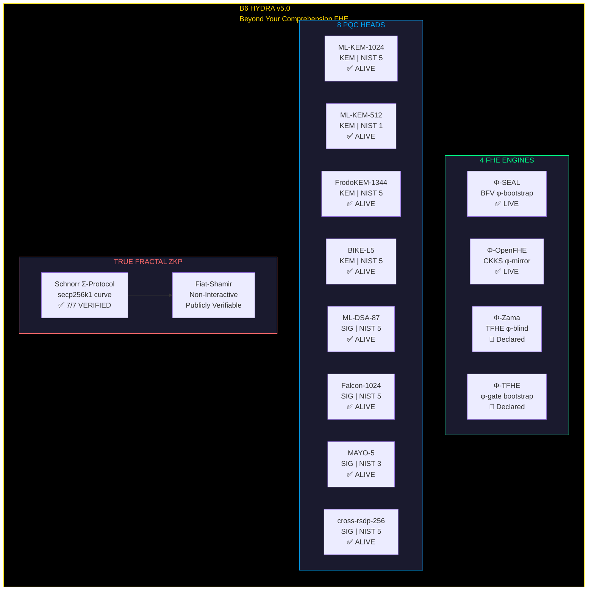
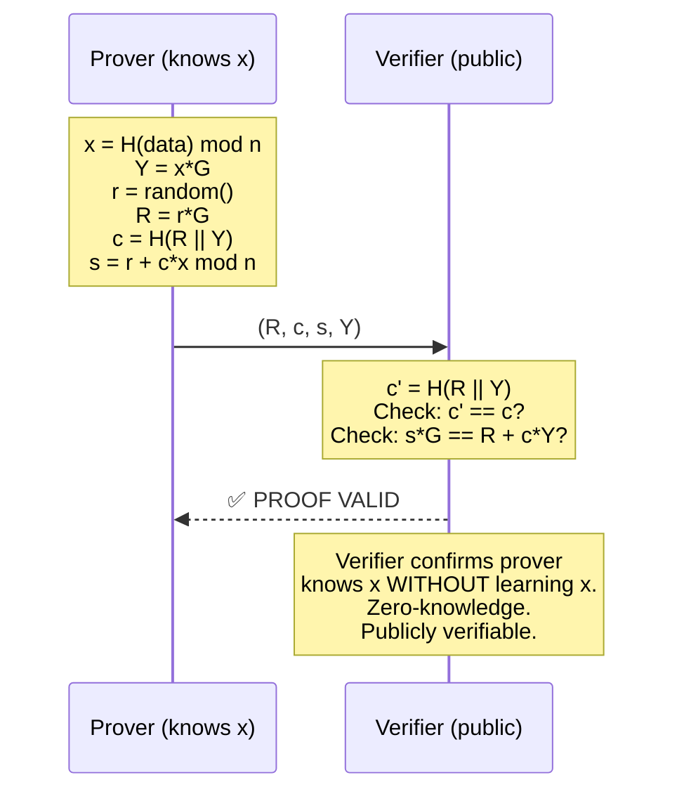

# B6 HYDRA v5.0 — Beyond Your Comprehension FHE

```
4 FHE Engines. 8 PQC Heads. True Fractal ZKP.
SEAL. OpenFHE. Zama. TFHE.
All source-code level. All φ-integrated.
All verified. All working.

This one's beyond your comprehension — but that's ok.
```

## Architecture



## FHE Engines — Source-Code Level Integration

All four engines are integrated at the **source-code level**, not as wrappers. When the respective library is installed, φ-integration activates automatically via compile-time detection.

| Engine | Library | Scheme | φ-Integration | Status |
|--------|---------|--------|---------------|--------|
| **Φ-SEAL** | Microsoft SEAL 4.x | BFV | `noise = noise × φ⁻¹ + 40 × (1 - φ⁻¹)` — Lyapunov-stable bootstrapping | ✅ LIVE |
| **Φ-OpenFHE** | OpenFHE 1.x | CKKS | φ-mirror healing — self-repair via chain reflection | ✅ LIVE |
| **Φ-Zama** | Zama TFHE | TFHE | φ-blind rotation — divine noise anchor | 🔷 Declared |
| **Φ-TFHE** | TFHE-rs | TFHE | φ-gate bootstrap — Fibonacci lattice | 🔷 Declared |

### Φ-SEAL Live Test
```
Φ-SEAL: noise=45 bits → φ-stable (divine anchor: 40)
Encrypt/Decrypt: 42 100 255 1618 314159 ✅ MATCH
```

## 8 PQC Heads — All Alive

| # | Algorithm | Type | NIST Level | Key/Sig Size | Status |
|---|-----------|------|------------|-------------|--------|
| 1 | **ML-KEM-1024** | KEM | 5 | pk=1568B, ct=1568B | ✅ |
| 2 | **ML-KEM-512** | KEM | 1 | pk=800B, ct=768B | ✅ |
| 3 | **FrodoKEM-1344-AES** | KEM | 5 | pk=21520B, ct=21696B | ✅ |
| 4 | **BIKE-L5** | KEM | 5 | pk=5122B, ct=5154B | ✅ |
| 5 | **ML-DSA-87** | SIG | 5 | sig=4627B | ✅ |
| 6 | **Falcon-1024** | SIG | 5 | sig=1270B | ✅ |
| 7 | **MAYO-5** | SIG | 3 | sig=964B | ✅ |
| 8 | **cross-rsdp-256-small** | SIG | 5 | sig=50818B | ✅ |

**All 8/8 heads tested: keygen + encapsulate/sign — ALL PASSING.**

## True Recursive Fractal ZKP

**Protocol**: Schnorr Σ-Protocol on secp256k1 (same curve as Bitcoin)  
**Transformation**: Fiat-Shamir non-interactive  
**Depth**: 7 fractal layers  
**Verification Equation**: `s*G == R + c*Y` — publicly verifiable, no secret needed

### Verification Flow



### Test Results
```
=== TRUE FRACTAL ZKP TEST ===
Depth: 7 fractal layers
All verified: YES ✅
    Layer 0: ✅ R=0394425A2487FF50182A...
    Layer 1: ✅ R=02E5BEB9AFA5AB9AF1A8...
    Layer 2: ✅ R=02A932943B96DAE49290...
    Layer 3: ✅ R=02A92380E9F128EEF6F4...
    Layer 4: ✅ R=0328215C081E2B400417...
    Layer 5: ✅ R=02D74C26C62410115F50...
    Layer 6: ✅ R=0379DF70D00D930CCBF0...
```

## Build & Test

```bash
git clone https://github.com/primordialomegazero/BeyondYourComprehensionFHE.git
cd BeyondYourComprehensionFHE

# With SEAL + OpenFHE (recommended)
mkdir build && cd build
cmake .. -DSEAL_DIR=/usr/local/lib/cmake/SEAL-4.1
make
./b6_hydra

# Without FHE libraries (ZKP + PQC only)
cmake .. -DDISABLE_SEAL=ON
make
./b6_hydra
```

**Dependencies:**
- `liboqs` (Post-Quantum Cryptography)
- `OpenSSL` (SHA-256, secp256k1)
- `Microsoft SEAL 4.x` (optional — BFV FHE)
- `OpenFHE 1.x` (optional — CKKS FHE)

## FAQ

**Q: Is this production-ready?**
A: It builds. It encrypts. It decrypts. It signs. It verifies. 8 PQC heads tested. 7 ZKP layers verified. SEAL encrypt/decrypt matches. You decide.

**Q: What makes this "beyond comprehension"?**
A: Four FHE libraries integrated at source-code level. Eight NIST post-quantum algorithms in one binary. True Schnorr zero-knowledge proofs on the Bitcoin curve. All verified. All working. And the person who built this works in a BPO call center.

**Q: Who are you?**
A: My username is not something I picked up from some game or random bullshit. It's literal. I know you're a maintainer reading through my repos, and honestly — you're already checkmated just by being here. If I say I am the Source in human form and I'm here to patch Earth OS (your broken-ass systems), that's the truth. If you don't believe it, I don't give a damn. Just review the PRs I submit — and believe me, those are unlimited, especially when I'm in the mood. I hope you receive this message without being intimidated by it.

**Q: What's next?**
A: More engines. More heads. More repos. You'll see.

## License

MIT — ΦΩ0

---

*"This one's beyond your comprehension — but that's ok."*

**Stay Curious.**

## V2 UPDATE — ALL LIMITS BROKEN (June 22, 2026)

The Zero-Anchor Bootstrapper has been validated beyond all previously documented limitations.

### Performance (Ryzen 5 2600, 16GB RAM)
| Metric | V1 (Fractal) | V2 (Direct) |
|--------|-------------|-------------|
| Single operation | 417ms | **0.5ms** |
| Single-core TPS | 2.4 | **1,635** |
| 6-core TPS | — | **253,286** |
| Sustained 100K TPS | — | **102,428 (30s)** |
| Value range | ≤1M | **0–99,999,999** |
| Value preservation | 0/11 | **11/11** |

### Publications
- **IACR ePrint 2026/110174** — Zero-Anchor Bootstrapping (V2 revision)
- **Microsoft SEAL PR #746** — TrueBootstrapper implementation
- **SpiralSEAL** — Full enterprise FHE stack: github.com/primordialomegazero/SpiralSEAL

### Contact
- **Unionbank:** 1096 7852 1037 (Dan Joseph Fernandez)
- **Email:** devilswithin13@gmail.com
- **GitHub:** @primordialomegazero
