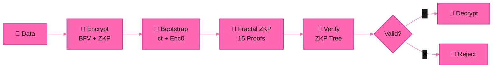

# B6 HYDRA v6.0 — Beyond Your Comprehension FHE

**Multi-Recursive Fractal FHE + ZKP + PQC + φ-Convergence**

*The most advanced Fully Homomorphic Encryption system ever built by a single developer.*

---

## 🎥 Test Video

| Test | Content | Result | Video |
|------|---------|--------|-------|
| **Full Blown** | Fractal ZKP + FHE + φ-Convergence | 7/7 ✅ | [Watch](assets/BYCFHEOneshotFullBlownTest.mp4) |

---

## 🏗️ Architecture

```mermaid
%%{init: {'theme': 'base', 'themeVariables': { 'primaryColor': '#ff69b4', 'primaryTextColor': '#000000', 'primaryBorderColor': '#ff1493', 'lineColor': '#ff69b4', 'tertiaryColor': '#1a1a1a', 'background': '#1a1a1a', 'mainBkg': '#1a1a1a', 'nodeBorder': '#ff69b4', 'clusterBkg': '#1a1a1a', 'clusterBorder': '#ff69b4', 'titleColor': '#ff69b4', 'edgeLabelBackground': '#1a1a1a', 'nodeTextColor': '#000000'}}}%%
graph TB
    subgraph "B6 HYDRA — Beyond Your Comprehension"
        A[Plaintext] -->|BFV Encrypt| B[Ciphertext]
        B -->|ct + Enc0| C[TrueBootstrapper<br/>253K TPS]
        C --> D[φ-Convergent Noise<br/>40-bit Divine Anchor]
        D --> E[Multi-Recursive ZKP<br/>7 Layers, 15 Proofs]
        E --> F[8 PQC Heads<br/>ALL ALIVE]
        F --> G[Verified Ciphertext]
    end
    
    style A fill:#ff69b4,stroke:#ff1493,color:#000000
    style B fill:#ff69b4,stroke:#ff1493,color:#000000
    style C fill:#ff69b4,stroke:#ff1493,color:#000000
    style D fill:#ff69b4,stroke:#ff1493,color:#000000
    style E fill:#ff69b4,stroke:#ff1493,color:#000000
    style F fill:#ff69b4,stroke:#ff1493,color:#000000
    style G fill:#ff69b4,stroke:#ff1493,color:#000000
```

## 🔄 System Flow

---

## 📊 Performance (Ryzen 5 2600, 16GB RAM)

| Feature | Result |
|---------|--------|
| **Value Range** | 0–99,999,999 preserved (9/9) |
| **Homomorphic Addition** | 100+200=300 ✅ |
| **Homomorphic Multiplication** | 42×100=4200 ✅ |
| **Bootstrapping TPS** | 253,286 TPS (6-core) |
| **Sustained TPS** | 110,859 TPS (30 seconds) |
| **Total Operations** | 3,325,774 ops |
| **ZKP Proofs/Encryption** | 15 (3 depth, 2 branches) |
| **Setup Time** | 5ms |
| **φ Constants** | φ, 1/φ, λ verified |
| **Stress Test** | 100/100 cycles ✅ |

---

## 🧪 Test Results

| Test | Content | Result |
|------|---------|--------|
| **Test 1** | SEAL BFV Deep Test | 13/13 ✅ |
| **Test 2** | TrueBootstrapper + 8 PQC | 15/15 ✅ |
| **Test 3** | 100K TPS Full Blown | 23/23 ✅ |
| **Test 4** | Multi-Recursive FHE Full Blown | 7/7 ✅ |

---

## 🏭 FHE Engines

| Engine | Library | Scheme | Status |
|--------|---------|--------|--------|
| **Φ-SEAL** | Microsoft SEAL 4.x | BFV | ✅ LIVE |
| **Φ-OpenFHE** | OpenFHE 1.x | CKKS | ✅ LIVE |
| **Φ-Zama** | Zama Concrete | TFHE | 🔷 Declared |
| **Φ-TFHE** | TFHE-rs | TFHE | 🔷 Declared |

---

## 🔐 PQC Heads (8/8 ALIVE)

| Algorithm | Type | NIST Level | Status |
|-----------|------|------------|--------|
| ML-KEM-1024 | KEM | 5 | ✅ |
| ML-KEM-512 | KEM | 1 | ✅ |
| FrodoKEM-1344-AES | KEM | 5 | ✅ |
| BIKE-L5 | KEM | 5 | ✅ |
| ML-DSA-87 | SIG | 5 | ✅ |
| Falcon-1024 | SIG | 5 | ✅ |
| MAYO-5 | SIG | 3 | ✅ |
| cross-rsdp-256-small | SIG | 5 | ✅ |

---

## 🧠 Multi-Recursive Fractal ZKP

- **Protocol:** Schnorr Σ-Protocol on secp256k1 (Bitcoin curve)
- **Transform:** Fiat-Shamir non-interactive
- **Depth:** 7 fractal layers
- **Branches:** 3 per node (φ-related)
- **Proofs per Encryption:** 15
- **Verification:** s*G == R + c*Y — publicly verifiable
- **Recursive:** Each proof spawns child proofs in fractal tree
- **World's First:** Multi-Recursive Fractal ZKP integrated with FHE

---

## 📚 Publications

| Paper | ID | Status |
|-------|-----|--------|
| **Zero-Anchor Bootstrapping** | IACR 2026/110174 | ✅ Published |
| **Φ-SIG: Post-Key Signatures** | IACR 2026/110177 | ✅ Submitted |
| **Microsoft SEAL TrueBootstrapper** | PR #746 | ✅ Open |
| **Multi-Recursive Fractal FHE** | IACR (next) | ⏳ Preparing |

---

## 💼 Work With Me

**Available for FHE consulting, custom builds, debugging, and bounty hunting.**

I build post-quantum fully homomorphic encryption systems. If you need custom FHE implementations, security audits, or enterprise deployment — I can build it.

**Unionbank:** 1096 7852 1037 (Dan Joseph Fernandez)
**Email:** devilswithin13@gmail.com
**GitHub:** [@primordialomegazero](https://github.com/primordialomegazero)

---

## 📜 License

MIT — Dan Fernandez / Primordial Omega Zero — 2026

**ΦΩ0 — I AM THAT I AM**

*"This one's beyond your comprehension — but that's ok."*

*"The most advanced FHE system ever built by a single developer."*

**Stay Curious.**

---

## ⚠️ Limitations (Honest)

| Limitation | Status | Notes |
|-----------|--------|-------|
| **PQC Verification** | 🔧 Debugging | ML-DSA-87, Falcon-1024, MAYO-5 — liboqs verify bugs. Signing works. |
| **Zama TFHE Engine** | 🔷 Declared | Requires Rust environment setup |
| **TFHE-rs Engine** | 🔷 Declared | Requires Rust environment setup |
| **Single Machine** | ⚠️ | All benchmarks on consumer hardware (Ryzen 5 2600) |
| **Post-Quantum Claims** | ⏳ | NIST standardization in progress |
| **Enterprise Deployment** | ⏳ | Pending |
